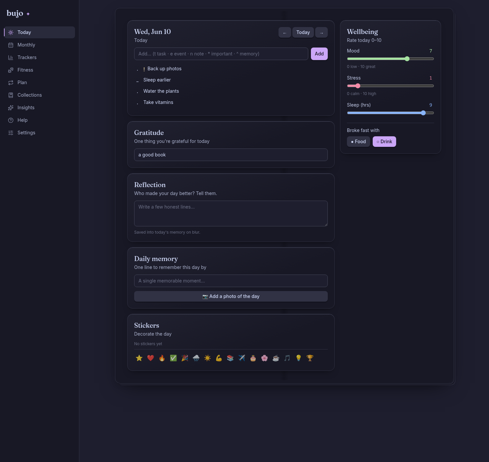
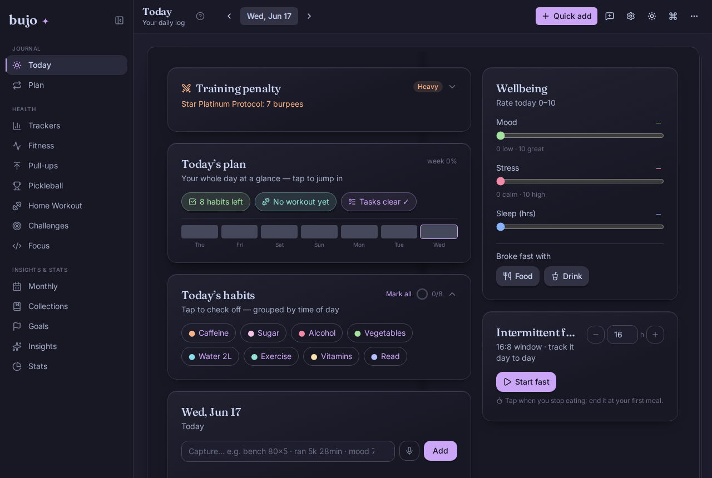
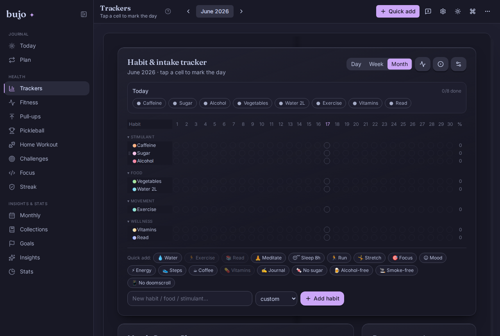
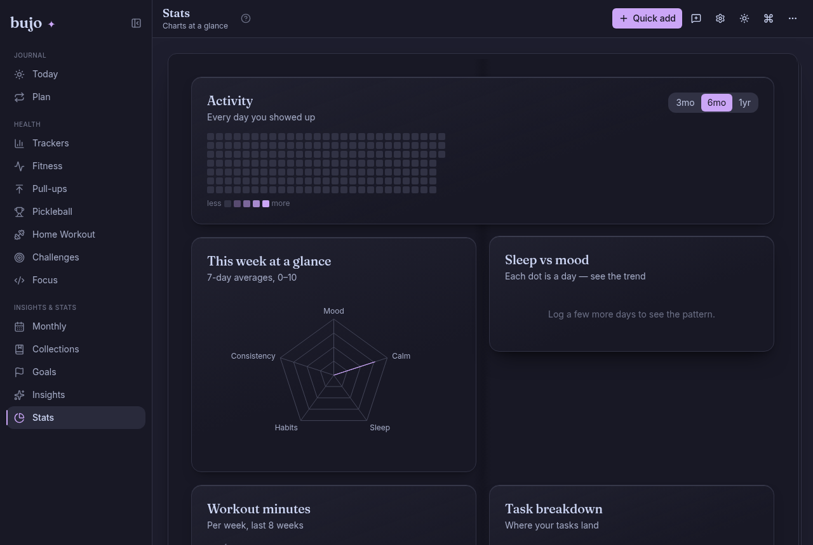
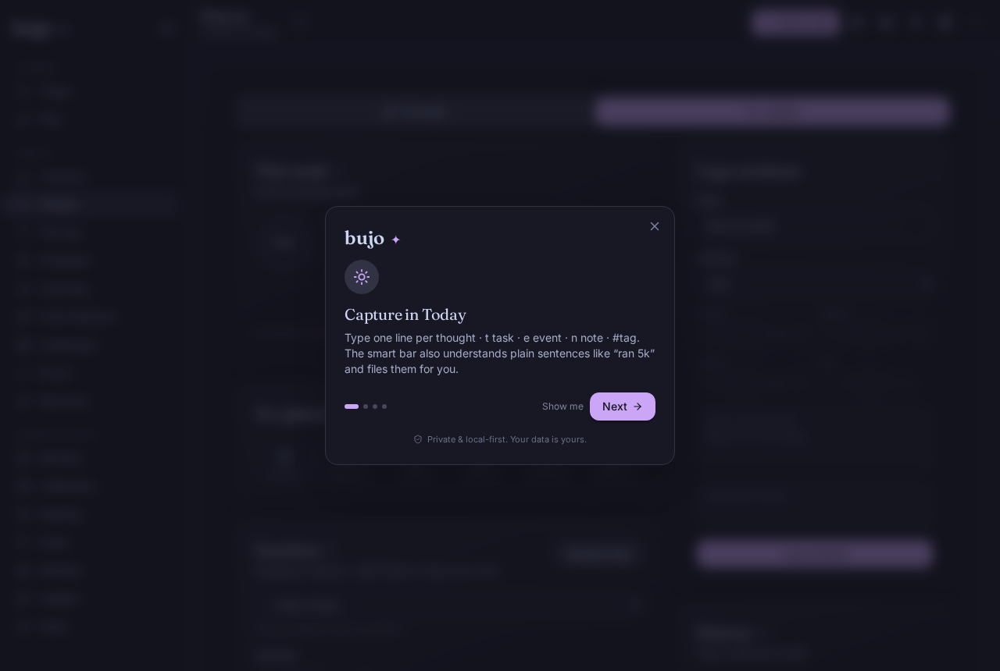
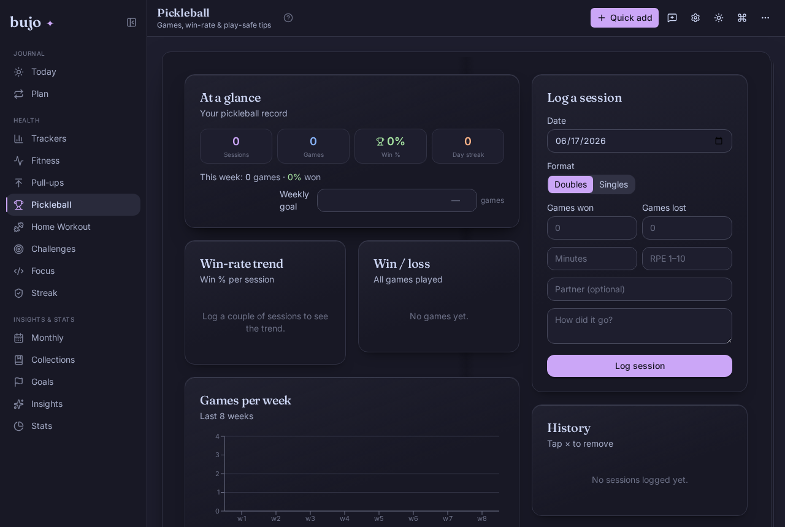
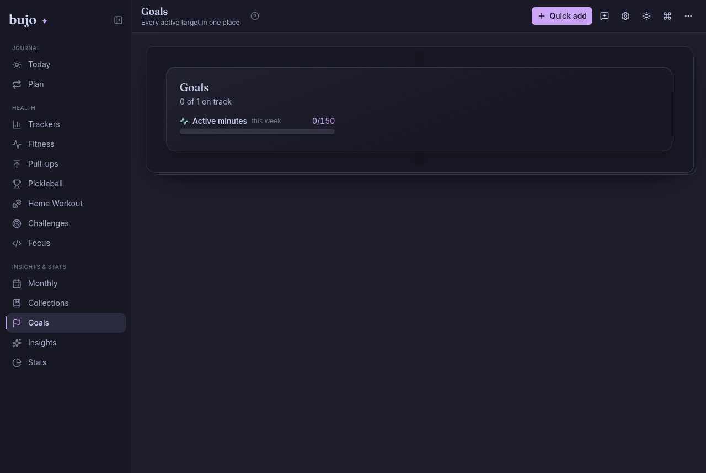
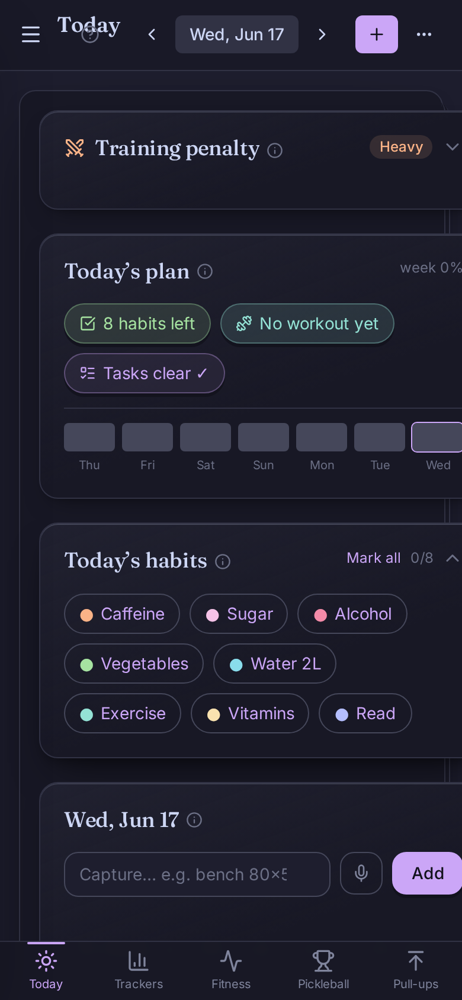
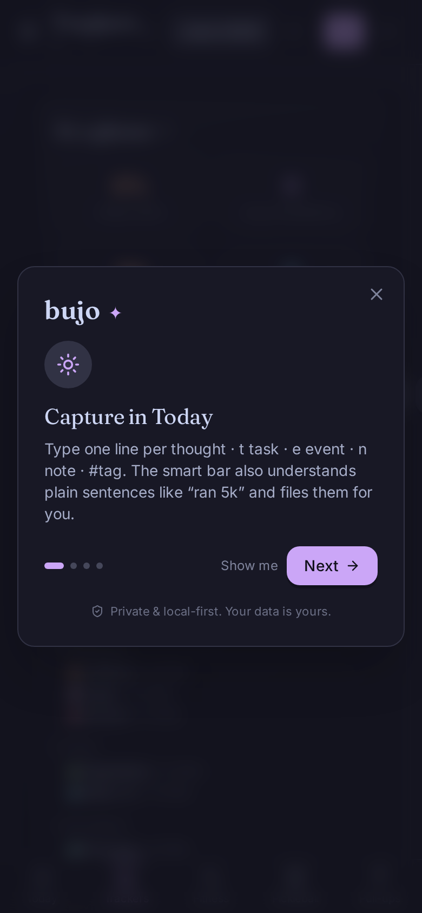
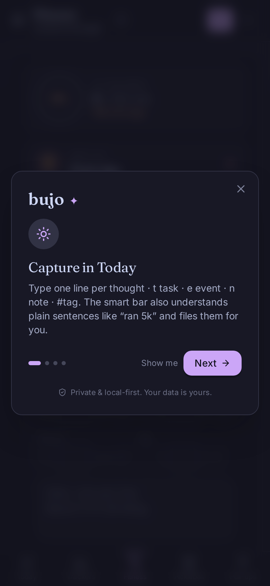

# ✦ bujo — a minimal digital bullet journal

A private, local-first **bullet journal** web app built around the
[Bullet Journal method](https://bulletjournal.com/) by Ryder Carroll, in a
minimal one-pen style. Rapid logging, monthly spreads, habit & mood tracking,
fitness logging, and gendered wellbeing tools — all stored **only in your
browser**. No accounts, no server, no tracking.



## Screenshots

**▶ Live demo: <https://bujo-journal.vercel.app>** — pick *“This device only”* to try it instantly, no account.

| Today | Trackers | Stats |
|---|---|---|
|  |  |  |

| Fitness | Pickleball | Goals |
|---|---|---|
|  |  |  |

**On a phone** — Today · Trackers · Fitness:

<p>
  
  
  
</p>

> These shots **auto-refresh after every deploy** — a GitHub Action
> (`.github/workflows/screenshots.yml`) rebuilds the app on each push to `main`
> and re-runs `npm run shots` (Playwright → `docs/screenshots/`). Regenerate
> locally with `npm run build && npm run preview` then `npm run shots`.

## Why

Most journaling apps lock your data behind a login and a subscription. `bujo`
keeps the calm, deliberate feel of a paper bullet journal — but adds the things
paper can't do: instant search, streaks, charts that overlay your mood against
your sleep, and one-click backups.

## Why bujo is different

Most journaling apps make you pick one virtue. bujo refuses the tradeoff — it's
**paper-minimal in feel, quantified-self in power, and zero-knowledge in
privacy, at the same time, for free.**

| | **bujo** | Day One | Notion | Journey | Paper |
|---|:---:|:---:|:---:|:---:|:---:|
| Price | **Free (MIT)** | $35/yr | paid | $25/yr | notebook |
| Account required | **No** | Yes | Yes | Yes | No |
| Data location | **Your browser only** | their cloud | their cloud | their cloud | your bag |
| Offline (PWA) | **Yes** | partial | poor | partial | always |
| Bullet Journal method | **Native** | — | manual | — | yes |
| Habit grid + mood/sleep chart | **Built-in** | — | manual | basic | by hand |
| Auto correlations (sleep↔stress) | **Yes** | — | — | — | — |
| Fitness log | **Yes** | — | manual | — | by hand |
| Gendered wellbeing (cycle / NoFap) | **Opt-in** | — | — | — | — |
| Recurring tasks + migration ritual | **Yes** | — | manual | — | yes |
| Open-book look & feel | **Yes** | — | — | — | yes |
| Own/export your data | **1-click JSON+MD** | locked-in | partial | partial | retype |

**Six things nobody else combines:** local-first + free + no account · the real
Ryder-Carroll method · a client-side correlation engine · gender-aware wellbeing ·
paper *feel* (book frame, dot-grid, handwriting, stickers) with digital power
(search, streaks, charts) · honest data ownership (Markdown export → Obsidian).

> **Try the live demo:** open the app with `?demo=1` to load a month of sample data.

## Features

| Area | What you get |
|---|---|
| **Rapid logging** | Tasks `·`, events `○`, notes `–`, with `✕` done, `>` migrated, `!` important, `▲` memory, `~` dropped. Click a glyph to cycle status. |
| **Quick capture** | Type `t`/`e`/`n` to set kind, `*` important, `^` memory, `#tag` to tag — Enter to log. |
| **Today** | Daily log, mood/stress/sleep sliders (0–10), fast-break marker, gratitude line, daily memory **with photo**. |
| **Monthly** | Calendar with event dots, location (for travelers), goals, and a **photo of the month**. |
| **Trackers** | Habit/stimulant/food dot-grid with 30-day consistency %, plus a mood·stress·sleep line chart. |
| **Fitness** | Workout log: activity, duration, distance, RPE, notes, totals, plus a **nutrition / macro diary** (calories + protein/carbs/fat). |
| **Gym** | Push/Pull/Legs training: split selector with next-day suggestion, PPL routines, structured set logging, **personal records**, **body-weight chart**, a **muscle map** showing what each split works, and a **wger exercise database** (search + images). |
| **Stats** | Visual dashboard: activity heatmap, weekly radar, sleep-vs-mood scatter, workout-minutes bars, task-status donut, mood calendar, tag cloud. |
| **Collections** | Future log (everything dated ahead) and a birthday list. |
| **Insights** | Current & longest streaks, task-completion %, and full-text search across everything. |
| **On this day** | Resurfaces entries and memories from the same date in past months. |
| **Wellbeing (gendered, optional)** | A neutral cycle/temperature chart, or a NoFap abstinence streak journal with milestones and a judgement-free relapse log — toggled by profile. |
| **Plan** | Recurring tasks (daily/weekly), end-of-month **migration** flow, **calendar (.ics) import**. |
| **Realism** | Dot-grid **paper texture**, **handwriting** font, **taped-in** photos, page-turn animation, emoji **stickers**, rotating **reflection prompts**. |
| **Smart** | **Correlation** insights (sleep↔stress↔mood), 7-day rolling averages, **year-in-review**, index. |
| **Daily life** | **Reminders** + browser notifications, opt-in **weather + auto-location**, **PWA** install + offline. |
| **Backups** | Export/import **JSON**, export **Markdown** (Obsidian/Logseq friendly). |
| **Polish** | Editorial serif titles + clean line icons, Catppuccin Mocha **dark** + Latte **light**, subtle 3D depth, fully responsive, keyboard-friendly, image uploads auto-downscaled. |

## Tech

- **Vite + React 19 + TypeScript**
- **Tailwind CSS v4** (Catppuccin Mocha/Latte theme tokens)
- **Recharts** for the line charts (lazy-loaded)
- **localStorage** persistence — zero backend
- **Vitest + Testing Library** (200+ tests)

## Getting started

```bash
npm install
npm run dev      # http://localhost:5173
npm test         # run the test suite
npm run build    # production build to dist/
```

The app is a static SPA — deploy `dist/` anywhere (Vercel, Netlify, GitHub
Pages). Your journal data never leaves the browser.

## Privacy

Everything is stored in your browser's `localStorage` under the key `bujo:data`.
There is no analytics, no network calls, no account. Because local storage can
be cleared by the browser, **export a backup regularly** (Settings → Export).

## Docs

- [`docs/WHY.md`](docs/WHY.md) — **why bujo: research, taste-direction, critical thinking & options** (incl. tracker-redesign directions)
- [`docs/PIPELINE.md`](docs/PIPELINE.md) — one-command ship pipeline (`scripts/ship.sh`) + CI
- [`docs/features/daily-use-guide.md`](docs/features/daily-use-guide.md) — feature guide & day-to-day use
- [`docs/PRD.md`](docs/PRD.md) — product requirements
- [`docs/ARCHITECTURE.md`](docs/ARCHITECTURE.md) — technical architecture
- [`docs/FRONTEND_SPEC.md`](docs/FRONTEND_SPEC.md) — frontend spec & design system
- [`docs/SECURITY.md`](docs/SECURITY.md) — security & privacy / threat model
- [`docs/ACCESSIBILITY.md`](docs/ACCESSIBILITY.md) — a11y status & checklist
- [`docs/DECISIONS.md`](docs/DECISIONS.md) — decision log (why it's built this way)
- [`docs/FEATURES.md`](docs/FEATURES.md) — feature reference
- [`docs/TICKETS.md`](docs/TICKETS.md) — feature ticket list (every epic)
- [`docs/GOOGLE_DRIVE.md`](docs/GOOGLE_DRIVE.md) — optional Drive sync setup
- [`docs/prompts/`](docs/prompts/) — reusable build prompts:
  [build from scratch](docs/prompts/00-build-from-scratch.md),
  [add feature](docs/prompts/01-add-feature.md),
  [add login/sync](docs/prompts/02-add-login-and-sync.md),
  [add tracker module](docs/prompts/03-add-tracker-module.md),
  [build this *kind* of app](docs/prompts/04-build-this-kind-of-app.md)

## Roadmap

- Optional passcode + client-side encryption (Web Crypto)
- Multi-user accounts & cloud sync (opt-in backend) — see `docs/prompts/02-add-login-and-sync.md`
- Command palette (`Cmd/Ctrl-K`)
- Custom free-form collections UI

## References & inspiration

All code here was written from scratch (see [CREDITS.md](CREDITS.md) for full
attribution and dependency licenses). These are the sources that shaped the
features and design:

- **Bullet Journal method — Ryder Carroll** · https://bulletjournal.com/
- **"My Minimalist Bullet Journal" (Elsa, van-life series)** · https://www.youtube.com/watch?v=DRt8j7H1GvE
  — one-pen style, location-per-month calendar, gratitude & daily-memory pages, mood/stress/sleep + intake trackers
- **"EASY Minimalist BULLET JOURNAL Set Up 2025 | HOW TO START"** · https://www.youtube.com/watch?v=6_SqKVS_8pM
  — minimalist monthly setup & beginner spreads
- **The Lazy Genius — "How to Bullet Journal"** · https://www.thelazygeniuscollective.com/blog/how-to-bullet-journal
  — index / future log / signifiers / migration / threading / collections
- **GRIT (by 8sujan6)** · https://github.com/8sujan6/GRIT
  — fitness features: fast set logging, custom routines, exercise library, personal records, body-metrics, offline-first
- **wger** · https://wger.de/en/software/features · https://wger.de/en/exercise/overview/
  — nutrition / macro diary, body-weight tracking, and the **exercise database + images** (used via wger's public API, CC-BY-SA)

Full credits, library licenses (React, Recharts, lucide, Tailwind, Catppuccin,
fonts) and network-service attributions are in **[CREDITS.md](CREDITS.md)**.

## License

MIT — see [LICENSE](LICENSE).
