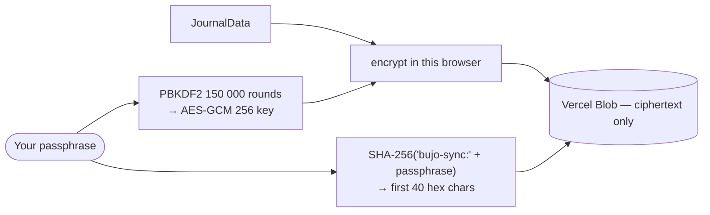

# Accounts, identity and sync

**bujo has no accounts.** Not "accounts are optional" — there is no login, no
password, no provider, and no server that knows who you are. This page says what
each piece actually is, because the words the industry uses for these things
(*account*, *sign in*, *secure*) all imply a check against a server, and none of
them happens here.

## The three things people mean by "my account"

| What you want | What does it in bujo | What it is **not** |
|---|---|---|
| The app knowing my name | **Local profile** — `settings.profile`, a name and an emoji | Not authentication. Nothing is verified. |
| My journal on two devices | **Sync passphrase** — `lib/bujocloud.ts` | Not an account. A shared secret, not a login. |
| Nobody else reading my journal | **Passcode lock** — `lib/crypto.ts`, Settings → Sync & privacy | Not the profile. The name protects nothing. |

They are independent. You can have any, all, or none. The common mistake — the
one this page exists to prevent — is assuming the first implies the third.

## Local profile

A name and an emoji, stored in the journal like any other setting and saved to
the same `localStorage` key as your entries.

**It is identity, not authentication.** There is no password because there is
nothing to check a password against. A password stored beside the data it claims
to guard is theatre: anyone who can read one can read the other. So the profile
is exactly what it looks like — a label, so the app can greet you and so a
shared export says whose journal it is.

Anyone holding your unlocked device can read it, change it, or delete it. If
that matters, the passcode lock is the control that actually addresses it.

## Sync passphrase

One passphrase does two jobs: it derives the key, which never leaves your
device, and it derives the *path*, which does. The server stores ciphertext at a
location it cannot invert back into the passphrase.

Four consequences, all of them worth knowing before you turn it on:

- **Anyone with the passphrase has the journal.** There is no per-person
  identity to separate two people who know it — they read and write the same
  blob. A leaked passphrase is a leaked journal, and there is no revocation.
- **A lost passphrase cannot be recovered.** By construction, not as an
  oversight. There is no reset, and building one would mean the server holding
  something that could decrypt your data.
- **It is sync, not backup.** One blob per passphrase, overwritten in place. No
  version history. Keep real backups — Settings → Data → export.
- **Photos may not travel.** Vercel caps a request body at 4.5 MB; over that the
  journal syncs and the images stay behind, reported as `photos-skipped`.

Other sync targets — a folder you pick, a private GitHub gist, Google Drive, a
self-hosted PostgREST stack — work the same way as far as identity goes: they
authenticate to *that service*, never to bujo. See
[`diagrams/storage-and-sync.md`](diagrams/storage-and-sync.md).

## Passcode lock

The only control here that actually restricts access. PBKDF2 → AES-GCM over the
whole journal at rest, so `localStorage` holds ciphertext (`bujo:enc`) instead of
plaintext (`bujo:data`). Web Crypto, entirely local, nothing transmitted.

Same rule as the passphrase: **no recovery.** It is the honest cost of the key
never leaving your device.

## Words this app does not use, and why

Copy near any of this has to keep the promise the mechanism makes. These are
banned on purpose:

| Never say | Because |
|---|---|
| "Sign in" / "Log in" for the profile | No credential is checked, so nothing can fail. It's a name. |
| "Secure account", "protected", "private account" | The profile secures nothing. The passcode does, and it is a separate setting. |
| "Your account" for the passphrase | `bujocloud` has no accounts. Two people with one passphrase are not two users. |
| "Forgot passphrase?" | There is no reset path and there will not be one. Say it cannot be recovered. |
| "Backed up" for sync state | One overwritten blob is not a backup. Say "synced". |

## Why accounts were removed (2026-09-11)

The app previously offered Supabase email+password and Google OAuth, across
**three separate copies of the same form** (Account, Welcome, Settings) plus two
more direct call sites. It was removed, not deprecated:

- **An email address is a liability with no matching benefit here.** Collecting
  one makes the project a data controller, obliges a privacy policy and a
  deletion path, and buys a user nothing that the passphrase does not already
  do — the passphrase syncs across devices without anyone learning who you are.
- **It contradicted the product.** `PRODUCT_GAPS.md` committed to "Path A —
  local-first, bring-your-own-cloud", and explicitly listed accounts-plus-database
  as Path B, not being done. The login screen was Path B's front door, shipped
  anyway, and it was the *first* thing a new user saw.
- **Two mechanisms for one job.** `bujocloud` already did cross-device sync,
  better, with less to trust.

Anyone still signed in when this shipped is offered a one-time migration on next
launch: their cloud journal is pulled, merged through the normal conflict path
(never a silent replace), and the session signed out. It runs once, is gated on
a settings flag so a reload cannot re-prompt, and fails loudly rather than
silently dropping the offer.

## See also

- [`diagrams/storage-and-sync.md`](diagrams/storage-and-sync.md) — every write path, with the crypto parameters
- [`PRODUCT_GAPS.md`](PRODUCT_GAPS.md) — Path A vs Path B, and why B is not being built
- [`SECURITY.md`](SECURITY.md)
