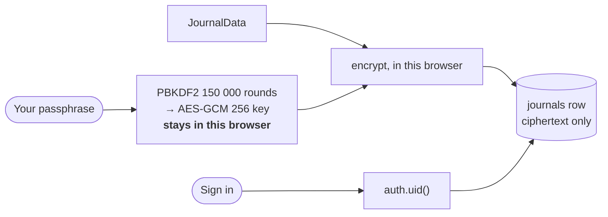

# Accounts, identity and sync

**bujo has accounts again, and they cannot read your journal.** That sentence
is the whole design. An account here is a *name for a row* — it says which
ciphertext is yours and nothing else. The encryption key is derived in your
browser from a passphrase the server never receives, so signing in does not
make one word of your journal readable to anyone who runs the server, breaches
it, or subpoenas it.

This page used to open *"bujo has no accounts."* It was true for six months and
this change makes it false, so the page is rewritten rather than amended —
[why accounts came back](#why-accounts-came-back-2026-09-27) records both
decisions, because the reasoning that removed them is still right about
everything except the one thing that changed.

## Four things people mean by "my account"

| What you want | What does it | What it is **not** |
|---|---|---|
| The app knowing my name | **Local profile** — `settings.profile`, a name and an emoji | Not authentication. Nothing is verified. |
| A row of my own to sync to | **Account** — Supabase Auth, `lib/supacloud.ts` | Not a place your journal is readable. |
| My journal on two devices without an account | **Sync passphrase** — `lib/bujocloud.ts` | Not a login. A shared secret. |
| Nobody else reading my journal on this device | **Passcode lock** — `lib/crypto.ts` | Not the profile, and not the account. |

They are independent. You can have any, all, or none. The common mistake — the
one this page exists to prevent — is assuming the second implies the fourth. It
does not. **Signing in protects nothing on this device.**

## What the server holds, exactly


```mermaid
flowchart LR
  pass([Your passphrase]) --> key["PBKDF2 150 000 rounds<br/>→ AES-GCM 256 key<br/><b>stays in this browser</b>"]
  journal[JournalData] --> enc["encrypt, in this browser"]
  key --> enc
  acct([Sign in]) --> uid["auth.uid()"]
  enc --> row[("journals row<br/>ciphertext only")]
  uid --> row
```

| Supabase can see | Supabase cannot see |
|---|---|
| Your email address, and a uuid | Your passphrase |
| `journals.ciphertext` — base64 AES-GCM bytes | The PBKDF2 key, the AES key, or anything they derive from |
| `journals.updated_at` | One word of the journal |
| How long the ciphertext is, i.e. roughly how much you journal | Which days you wrote, what you tracked, any photo |

The length is a real leak and is listed on purpose. It is the honest cost of
storing one blob per user, and the alternative (padding to a fixed size) would
cost bandwidth for every push to hide a number that already shows up in your
`updated_at` timestamps.

**The row is addressed by your user id.** That is better than the passphrase
path it sits beside, where the locator is `SHA-256('bujo-sync:' + passphrase)` —
a function of the secret, and therefore something an attacker holding a list of
common passphrases can grind against. A uuid is not a function of anything you
chose.

## Signing in

No password. Ever. You type an email address, Supabase sends a one-time link,
the link signs you in.

| Why not a password | |
|---|---|
| Nothing to store | A password is a second secret this project would hold and could leak |
| Nothing to reset | "Forgot password" is a whole flow that exists only because passwords do |
| Nothing to reuse | People reuse passwords; an email link cannot be reused anywhere |
| It buys nothing | The login's only job is to name a row. A password does not name it better |

`lib/auth.contract.test.ts` fails the build if a password field, a
`signInWithPassword` call or a reset path appears anywhere in the source.

**An account is not a recovery path.** If you lose the passphrase, signing in
gets you a row of bytes you cannot open. That is by construction and there will
not be a reset, because a reset means the server holding something that can
decrypt your journal.

## Sync passphrase

One passphrase does two jobs: it derives the key, which never leaves your
device, and — on the no-account blob path — it derives the *path*, which does.

Four consequences, all worth knowing before you turn it on:

- **Anyone with the passphrase has the journal.** On the blob path there is no
  per-person identity, so two people who know it read and write the same blob.
  An account fixes the addressing half of this; it does not change the fact
  that the passphrase opens the data.
- **A lost passphrase cannot be recovered.** By construction, not as an
  oversight.
- **It is sync, not backup.** One blob per passphrase, overwritten in place. No
  version history. Keep real backups — Settings → Data → export.
- **Photos may not travel.** Vercel caps a request body at 4.5 MB; over that the
  journal syncs and the images stay behind, reported as `photos-skipped`.

Other sync targets — a folder you pick, a private GitHub gist, Google Drive, a
self-hosted PostgREST stack — authenticate to *that service*, never to bujo. See
[`diagrams/storage-and-sync.md`](diagrams/storage-and-sync.md).

## One sync target at a time

Turning on a second auto-sync target **pauses the first**. Four of them could
previously be live at once, on four different debounce windows, each with its
own rule for adopting a remote — and two could adopt different remotes in the
same second, with nothing anywhere detecting it (F-7).

| Rank | Target | Live when |
|---|---|---|
| 1 | The folder you picked | `storageMode === 'folder'` |
| 2 | Your self-hosted server | a URL and a token are set |
| 3 | The sync passphrase (blob) | auto-sync is on |
| 4 | Your account | signed in **and** a passphrase is remembered |

Ranking is only a tie-break for a journal that predates the setting; whenever
you switch a target on, that becomes the live one. **A paused target is not
deleted.** It keeps what it holds, Push and Pull by hand still reach it, and
the app names it on screen for as long as it is paused — because a folder that
quietly stops updating is a stale backup someone trusts a year later.

## Passcode lock

The only control here that restricts access to the journal **on this device**.
PBKDF2 → AES-GCM over the whole journal at rest, so `localStorage` holds
ciphertext (`bujo:enc`) instead of plaintext (`bujo:data`). Web Crypto, entirely
local, nothing transmitted.

Same rule as the passphrase: **no recovery.**

### Auto-sync used to hand over the cloud copy, in plaintext

This section previously read: auto-sync keeps the sync passphrase **in
plaintext** at `bujo:sync`, so with both switched on the measured contents of
`localStorage` were

```
bujo:enc    {"v":1,"salt":"R6+Ar…      103,399 characters of ciphertext
bujo:sync   correct-horse-battery
```

The lock did exactly what it says — `bujo:data` was gone — and it did not
matter, because the key to the cloud copy of the same journal sat beside it in
the clear. Read that string, call `pullCloud`, and the passcode was never in the
way. That was F-8.

**It is fixed, and not by making the passphrase disappear from the problem.**
`lib/syncKey.ts` now stores:

| | Where | What reading it gives an attacker |
|---|---|---|
| The PBKDF2 base key, `extractable: false` | IndexedDB `bujo-keys` | Nothing they can carry away. WebCrypto requires PBKDF2 keys to be non-extractable, so `exportKey` **always rejects** |
| The blob locator (`bujo:sync-code`) | `localStorage` | The ciphertext. Not the key |

The locator was never a secret from the server — it is the path every request
already sends. So a storage dump, a copied browser profile or an exfiltrating
script now yields an **encrypted blob** where it used to yield a journal.

**What is still true, and the copy in the app says so.** Script running on this
origin can still *use* the stored key: it can call `crypto.subtle.decrypt` and
read everything, because that is what the key is for. A browser cannot keep a
secret from someone holding the unlocked device, and any wording that claims
otherwise is the old false promise in newer words. The goal was to stop the
secret **leaving**, not to stop it being used, and that is what was achieved.

**Push and Pull by hand still store nothing at all.** They remain the
combination that keeps the passcode fully meaningful.

### What the upgrade does to a device that already had auto-sync on

Once, on the next load: the passphrase is read out of `bujo:sync`, imported as
a non-extractable key, verified by reading back, and only then deleted. A crash
between those steps leaves both and the next load finishes the job.

It announces itself with a toast, because it takes something away:

> Auto-sync now stores a key, not your passphrase. It can no longer be read out
> of this browser. Make sure your passphrase is written down — you need it to
> reach this journal from a new device.

That is the one real cost of the fix and it is not hidden. Before, someone who
forgot their passphrase could open devtools and read it back. Now they cannot.
The journal itself is never at risk — it is canonical in `localStorage` and
unchanged — but the cloud copy becomes unreachable from a *new* device without
the passphrase.

## Turning accounts on

**None of this is on by default, and a build with no Supabase configured
behaves exactly as the app always has.** The SDK sits behind a dynamic
`import()` that only runs when the variables are set, so an unconfigured build
never downloads it — and it is excluded from the service-worker precache, so it
costs an install nothing (measured: precache 3070.40 → 2860.63 KiB).

A human has to do all five of these. None of them is automated and none of them
happened when this was written — see the verification note at the bottom of the
SQL file.

| # | Step | Where |
|---|---|---|
| 1 | Create a Supabase project | <https://supabase.com/dashboard> |
| 2 | Run `supabase/migrations/0001_journals_e2ee.sql` | SQL editor, or `supabase db push` |
| 3 | Authentication → Providers → Email **on**, magic link **on**, Anonymous sign-ins **off** | dashboard |
| 4 | Authentication → URL Configuration → add the deployed origin and `http://localhost:4173` | dashboard |
| 5 | Set `VITE_SUPABASE_URL` and `VITE_SUPABASE_ANON_KEY` | `.env` locally, Vercel project env vars in production |

Copy `.env.example`. **The anon key, never the service_role key** — the latter
bypasses row-level security entirely, and the contract test fails the build if
the string `service_role` appears anywhere in `src/`.

Then verify the RLS policy actually holds, by attacking it. The procedure is at
the bottom of the migration file and step 4 is the one that matters: signed in
as B, try to `upsert` over A's `user_id` and confirm the database refuses. A
policy that filters `select` but permits a cross-user `update` passes a casual
test and loses someone's journal.

## Words this app does not use, and why

| Never say | Because |
|---|---|
| "Sign in" / "Log in" for the profile | No credential is checked. It's a name. |
| "Secure account", "protected account" | The account secures nothing on this device. The passcode does, and it is a separate setting. |
| "Your account" for the sync passphrase | The blob path has no accounts. Two people with one passphrase are not two users. |
| "Forgot passphrase?" | There is no reset path and there will not be one, with or without an account. |
| "Backed up" for sync state | One overwritten row is not a backup. Say "synced". |
| "The passcode protects your journal" with auto-sync on | It protects the copy on this device. The stored key opens the cloud copy. Qualify it or do not say it. |
| "End-to-end encrypted" about the *account* | Say it about the journal. The account is not encrypted; it is an email address on a server. |

## Why accounts came back (2026-09-27)

They were removed on 2026-09-11 for three reasons. Two of them are still
correct and are the reason this version looks nothing like the old one.

| The 2026-09-11 reason | Still true? |
|---|---|
| "An email address is a liability with no matching benefit" | **Half.** Still a liability — this project is a data controller again and owes a deletion path. The benefit is no longer zero: a uuid addresses a row without hashing the user's secret to find it, which the blob path has to do. |
| "It contradicted the product — Path A, local-first, bring-your-own-cloud" | **Yes, and it is honoured.** The old login was the *first thing a new user saw*, at the front door of a local-first app. This one is a card on the Account page that **renders nothing** unless a project is configured, and no journal byte moves anywhere because of it. |
| "Two mechanisms for one job — `bujocloud` already did cross-device sync" | **Yes, and that is now enforced rather than argued.** They can no longer both run: one auto-sync target at a time (F-7). |

What changed is narrower than "accounts are good now":

- **The old accounts stored `data jsonb` — the journal, readable, server-side.**
  That is in the schema file this change replaces. The objection was never to
  identity; it was to a server that could read the journal. This one cannot.
- **A passphrase-derived locator is a weakness the blob path cannot fix.** With
  a real user id the passphrase does only the job it is good at: deriving a key.

The old rescue path, the old client and the old project are still gone. That
project's hostname stopped resolving (NXDOMAIN, measured 2026-09-15) before the
rescue was even retired, so a journal that existed only there was already
unreachable and nothing here recovers it.
`settings.legacyAccountChecked` stays in the type as an inert field: existing
journals carry it, and removing a key from `JournalData` is a one-way-door
schema change for no gain.

## What this change got wrong on the way

- **The first contract test read a string, not a use.** The rule "no file may
  mention `bujo:sync`" named six innocent files, because `bujo:sync` is *also*
  the name of the `CustomEvent` `SyncIndicator` listens for — and two of the
  six only mention the key in a comment explaining that it is gone. It now
  matches `localStorage.getItem('bujo:sync')`, the call. Same family as the
  `help=` sweep in `CLAUDE.md` that missed every card rendering its ⓘ from
  `subtitle`.
- **A regex spanning lines reported both type-only importers as runtime ones.**
  `[^;]*` matches newlines, so the "does anything import the SDK at runtime"
  check walked from an unrelated `import { useState }` on one line to the
  `@supabase` specifier on the next. `[^\n]*` is the fix; an unanchored
  multiline regex is a regex matching the wrong line.
- **The SDK chunk had no name to exclude.** Rollup named it `dist-<hash>.js`,
  after `@supabase/supabase-js/dist/module`, which matches nothing anyone would
  write in a `globIgnores` and would have silently stopped matching on an
  upgrade. Named explicitly in `vite.config.ts`.

## See also

- [`../supabase/migrations/0001_journals_e2ee.sql`](../supabase/migrations/0001_journals_e2ee.sql) — the table, the RLS policies, and how to attack them
- [`DATA-STORE-DECISION.md`](DATA-STORE-DECISION.md) — §1 canonical store, §2 every store, §8 F-7 and F-8
- [`diagrams/storage-and-sync.md`](diagrams/storage-and-sync.md) — every write path, with the crypto parameters
- [`PRODUCT_GAPS.md`](PRODUCT_GAPS.md) — Path A vs Path B
- [`SECURITY.md`](SECURITY.md)
