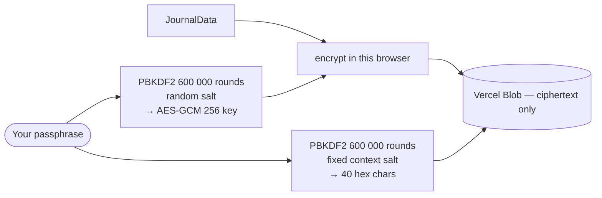

# Accounts, identity and sync

**bujo has one account, and it is not what an account usually means.** As of
COD-271 there is a Google sign-in, and a per-account row in Supabase holding
your journal — **as ciphertext**. The server knows who you are and cannot read
what you wrote.

That distinction is the whole page. The words the industry uses for these things
(*account*, *sign in*, *secure*, *backed up*) all imply a server that holds your
data and can give it back to you; here the server holds your data and **cannot**
give it back to you without a passphrase it has never seen.

> **The account is recoverable. The journal is not.** Lose the passphrase and
> you can still sign in, your row is still there, and it is permanently
> unreadable. Say this wherever sign-in is offered — it is the single sentence
> most likely to be assumed the other way.

Everything below still applies: the local profile, the sync passphrase and the
passcode lock are unchanged, and the app works with no account at all.

## The three things people mean by "my account"

| What you want | What does it in bujo | What it is **not** |
|---|---|---|
| The app knowing my name | **Local profile** — `settings.profile`, a name and an emoji | Not authentication. Nothing is verified. |
| My journal on two devices | **Sync passphrase** — `lib/bujocloud.ts` | Not an account. A shared secret, not a login. |
| Nobody else reading my journal | **Passcode lock** — `lib/crypto.ts`, Settings → Sync & privacy | Not the profile. The name protects nothing. |

They are independent. You can have any, all, or none. The common mistake — the
one this page exists to prevent — is assuming the first implies the third.

## Local profile

A name and an emoji, stored in the journal like any other setting and saved to
the same `localStorage` key as your entries.

**It is identity, not authentication.** There is no password because there is
nothing to check a password against. A password stored beside the data it claims
to guard is theatre: anyone who can read one can read the other. So the profile
is exactly what it looks like — a label, so the app can greet you and so a
shared export says whose journal it is.

Anyone holding your unlocked device can read it, change it, or delete it. If
that matters, the passcode lock is the control that actually addresses it.

## Sync passphrase


```mermaid
flowchart LR
  pass([Your passphrase]) --> key["PBKDF2 600 000 rounds<br/>random salt<br/>→ AES-GCM 256 key"]
  pass --> path["PBKDF2 600 000 rounds<br/>fixed context salt<br/>→ 40 hex chars"]
  journal[JournalData] --> enc["encrypt in this browser"]
  key --> enc
  enc --> blob[("Vercel Blob — ciphertext only")]
  path --> blob
```

One passphrase does two jobs: it derives the key, which never leaves your
device, and it derives the *path*, which does. The server stores ciphertext at a
location it cannot invert back into the passphrase.

**Both jobs are now stretched the same amount, and that is the point.** Until
COD-267 the key was PBKDF2 at 150 000 rounds while the path was a *single
unsalted SHA-256* of the same passphrase — so the cheapest attack on the
passphrase was never against the ciphertext, it was against the path code, by a
factor of 150 000. And the path code is the half that leaves the device: it
travelled in a query string, into serverless access logs, CDN logs, browser
history and `Referer` headers. It is an `x-sync-code` header now.

The path's salt is a fixed context string and has to be — the server must find
the blob knowing only what the client sends, and there is no account to hang a
per-user salt on. That is the real ceiling of a no-accounts design, written down
rather than hidden.

Four consequences, all of them worth knowing before you turn it on:

- **Anyone with the passphrase has the journal.** There is no per-person
  identity to separate two people who know it — they read and write the same
  blob. A leaked passphrase is a leaked journal, and there is no revocation.
- **A lost passphrase cannot be recovered.** By construction, not as an
  oversight. There is no reset, and building one would mean the server holding
  something that could decrypt your data.
- **It is sync, not backup.** One live blob per passphrase, overwritten in
  place. It now keeps the **three previous payloads** (COD-266) — because the
  endpoint is unauthenticated by design, so before that a single POST destroyed
  a journal permanently, and "sync is not a backup" was a statement about
  version history rather than a licence to have none. Three ten-minute-apart
  snapshots is a recovery path, not a backup: there is no UI for it, and reading
  one is a `curl` (see below). Keep real backups — Settings → Data → export.
- **Photos may not travel.** Vercel caps a request body at 4.5 MB; over that the
  journal syncs and the images stay behind, reported as `photos-skipped`.

Other sync targets — a folder you pick, a private GitHub gist, Google Drive, a
self-hosted PostgREST stack — work the same way as far as identity goes: they
authenticate to *that service*, never to bujo. See
[`diagrams/storage-and-sync.md`](diagrams/storage-and-sync.md).

## Passcode lock

The only control here that restricts access to the journal on this device.
PBKDF2 → AES-GCM over the whole journal at rest, so `localStorage` holds
ciphertext (`bujo:enc`) instead of plaintext (`bujo:data`). Web Crypto,
entirely local, nothing transmitted.

Same rule as the passphrase: **no recovery.** It is the honest cost of the key
never leaving your device.

### Auto-sync used to defeat it. Fixed — COD-228

**This section has been wrong twice, in opposite directions, so read the dates.**
It first claimed the passcode was "the only control that actually restricts
access" with no qualifier, which the code did not honour. It was then corrected
to say auto-sync defeats the lock, which was true. As of COD-228 it no longer
does, and here is the mechanism rather than a reassurance.

The hole was not merely a key in the clear. The sync passphrase is also what
encrypts the **cloud** copy at `/api/sync`, and the storage path is *derived*
from it. So `bujo:sync` in plaintext meant anyone holding the locked device
could derive the path, download the blob and decrypt it — obtaining a
byte-identical copy of the journal the passcode was protecting, without ever
attacking the passcode. Measured at the time:

```
bujo:enc    {"v":1,"salt":"R6+Ar…      103,399 characters of ciphertext
bujo:sync   correct-horse-battery      the key to an identical remote copy
```

`lib/syncSecret.ts` is now the only thing that decides where that passphrase
may live:

| passcode set | where it lives |
|---|---|
| no | `bujo:sync`, plaintext. Unchanged, and correct — the journal is plaintext too, so sealing its key would be theatre. |
| yes | `bujo:sync.enc`, encrypted **under the passcode**, plus an in-memory copy that dies with the tab. |

In-memory means a module variable, not `sessionStorage`: the latter survives a
reload and is readable by any script on the origin, which is most of what this
stops.

Setting a passcode **re-seals** an existing plaintext key, and clearing one
unseals it. Without that the fix would only ever have protected new users, and
the plaintext key would have sat there untouched on every existing install.

**The cost, which is the honest half:** auto-sync does not run while the
journal is locked. That is the feature being truthful rather than a regression
— a journal you have locked should not be shipping itself anywhere until you
unlock it. `CloudSyncCard` now says that at the switch instead of asking you to
accept a plaintext key.

**Push and Pull by hand still store nothing.**

### Recovering an earlier cloud payload

There is deliberately no button for this. The history exists so a destroyed
journal is recoverable at all, not as a feature — and a version picker over
ciphertext is a real piece of UI that nobody has asked for. The passphrase's
path code is what addresses the blob, so recovery is:

```sh
# what can be recovered, newest first
curl -s 'https://<your-deploy>/api/sync?code=<path-code>&versions=1'
# one earlier payload — the same shape the normal pull reads
curl -s 'https://<your-deploy>/api/sync?code=<path-code>&v=<timestamp>' > old.json
```

The payload is ciphertext; decrypting it needs the passphrase, exactly as a
normal pull does. Snapshots are taken at most every ten minutes and only three
are kept, so this is a window of minutes-to-hours, not an archive.

## Signing in with Google: the setup, and reading a failure

Three places hold configuration, and a mistake in each one fails at a
**different step**. That matters more than the list does, because the step tells
you which of the three to open — and two of the three failures used to produce
an identical blank screen.

| Where | Holds | Fails at |
|---|---|---|
| Google Cloud Console → Credentials → OAuth 2.0 Client ID | the client ID, the client secret, and the **authorised redirect URI** | ID or URI: at Google, before you ever come back. Secret: at the exchange, after. |
| Supabase → Authentication → Sign In / Providers → **Google** | the same client ID and secret, pasted | the exchange |
| Supabase → Authentication → **URL Configuration** → Redirect URLs | which app origins may be returned to | after a *successful* sign-in — you land on the Site URL instead of where you started |

The redirect URI registered at Google is Supabase's callback, never this app's:

```
https://<project-ref>.supabase.co/auth/v1/callback
```

This app's own URL (`http://localhost:4173/**`, the Vercel origin) goes in
Supabase's **Redirect URLs** allowlist instead. Confusing the two is common and
the symptom is the last row of the table: sign-in works, and dumps you on the
wrong origin with the session attached to it.

### Which half is broken, in one command

`signInWithOAuth` hands off to Supabase's `authorize` endpoint, and that
endpoint's redirect is public, unauthenticated, and says exactly what Supabase
will present to Google:

```sh
curl -s -o /dev/null -w '%{redirect_url}\n' \
  "https://<project-ref>.supabase.co/auth/v1/authorize?provider=google"
```

Read `client_id` and `redirect_uri` out of the result. Nothing secret is in it.

**The deduction this enables is the useful part.** Google issues an
authorisation code (`4/0A…`) only *after* it has validated the client ID and
matched the redirect URI against the ones registered for that client. So if you
got a code back at all, those two are provably correct — and since the token
exchange sends exactly client ID, redirect URI and **secret**, a failed exchange
leaves one variable.

### The failure taxonomy

| What you see | Step | Almost always |
|---|---|---|
| Google's own error page, no return to the app | authorize | redirect URI not registered on that client, or wrong client ID |
| Back on the app, `error_description=Unable to exchange external code` | exchange | **the client secret** in the Supabase provider — stale, blank, or from a different OAuth client |
| Back on the app, `error=access_denied` | consent | the person pressed cancel |
| Signed in, but on the wrong origin | after | the app's URL is missing from Supabase's Redirect URLs |

Google shows a client secret once. If you cannot see it in the console, add a
new secret on that client and paste the new one — do not guess at the old.

### The app reports these now — COD-290

It did not, and that was a bug of its own rather than a gap in this page. The
**success** leg was handled: `detectSessionInUrl` consumes the fragment,
`onAuthChange` re-renders everything showing identity. The **failure** leg had
no handler anywhere. Supabase returns with the reason in the URL, there is no
session to detect, and the app drew its ordinary signed-out screen — identical
to never having clicked. Reported as *"I made a login, the screen is not
changing"*, which was precise: the screen was the one place the failure was
invisible, while the address bar had been carrying it the whole time.

`consumeAuthError()` in `lib/supabase.ts` reads it, reports it, and clears it.
Three decisions in it are load-bearing:

- **Called from `App`, not from `AccountCard`.** `redirectTo` returns you to the
  view you left, which is frequently not the account page. A failure reported
  only on a component that is not mounted is the same bug one layer up.
- **Reads the fragment *and* the query, and decodes twice.** Supabase
  double-encodes the fragment copy (`%253A` for a colon). The second decode is
  wrapped in a `try`, because a malformed escape must not throw on the one path
  whose job is reporting a failure.
- **Does not touch the URL unless `error` is present.** Stripping params on the
  success leg would race `detectSessionInUrl` for the fragment it needs.
  `lib/authError.test.ts` asserts this specifically — it is exactly the sort of
  thing a later tidy-up deletes.

The wording for a failed exchange says the fault is server-side provider setup
and that the journal is untouched. That is not padding: the provider's own words
("Unable to exchange external code: 4/0A…") read like something was lost, in an
app whose central warning is that a lost passphrase is a lost journal. Nothing
was lost, and the message has to say so faster than the fear arrives.

### The third silent failure: the redirect that never comes back — COD-293

Two legs were already handled. The success leg renders (COD-291, below); the
*refused exchange* leg reports (COD-290, above). This is the third, and it is
the quietest, because **the browser never returns to this app at all.**

`redirectTo` is a **request, not a guarantee.** Supabase checks it against the
project's Redirect URLs allow-list and, when it is not on the list, **silently
substitutes the project Site URL** — no error, no warning, nothing in any
response to read.

Measured on this project by asking Supabase to honour a `redirect_to` it is free
to reject and reading the `Location` it answers with
(`/auth/v1/verify?token=probe-not-a-token&type=magiclink&redirect_to=…`):

| Sent | Came back as | |
|---|---|---|
| `http://localhost:4173/?view=account` | the same URL | allowed |
| `http://localhost:5173/?view=account` | the same URL | allowed |
| `https://bujo-journal.vercel.app/?view=account` | `http://localhost:3000` | **rejected** |
| a preview deployment URL | `http://localhost:3000` | **rejected** |
| `https://evil.example.com/` | `http://localhost:3000` | rejected, correctly |

So the Site URL is `http://localhost:3000` — not a bujo port on any machine —
and **no deployed origin is allow-listed.** A Google sign-in from production can
therefore never complete: after Google, the browser is sent to a dead local
address, `detectSessionInUrl` never sees a fragment, and the app the user left
simply never runs again. Every successful sign-in anyone ever had was `:4173` or
`:5173`, both allowed, which is exactly why this stayed invisible.

**The fix is a dashboard setting**, Authentication → URL Configuration: Site URL
`https://bujo-journal.vercel.app`, and Redirect URLs covering
`https://bujo-journal.vercel.app/**`, the preview wildcard, and
`http://localhost:4173/**` + `http://localhost:5173/**`. **Keep the localhost
entries** — they are what makes local development work, and dropping them is how
this gets rediscovered from the other side.

**The code half is `lib/authReturn.ts`.** Nothing client-side can read the
allow-list, so the app cannot pre-empt this; what it can do is remember that it
left. A stamp is written immediately before the redirect and cleared the moment
a session *or* an error arrives, so a stamp still present on a later load means
the round trip was lost — and `AuthReturnReport` says so, naming the exact origin
to allow-list, because that string is the fix.

Three decisions in it are load-bearing, and all three are the same rules the
earlier legs taught:

- **It waits for `ready`.** Reporting on `!user` before the session resolves
  fires the message at a *successful* sign-in, in the gap between mount and
  `INITIAL_SESSION`. "Not yet" is not "not ever" — the wait-before-assert rule
  from `CLAUDE.md`, in application code rather than in a gate.
- **`consumeAuthError` clears the stamp.** An error *is* a resolution: the trip
  came back, it just came back badly. Without this, COD-290's message and this
  one both fire for one event, and two explanations are worse than either.
- **It is not time-limited, and it reads-and-clears.** A window would have to
  guess how long a consent screen takes, and this failure strands the user with
  no way back — so they return by typing the URL again, much later, which is
  precisely what a window would discard. Reading spends it, because a message
  that reappears every load is one people learn to dismiss.

The honest limit, stated in the copy itself: someone who opens Google and closes
the tab leaves the same evidence. So the message says the sign-in did not come
back (true either way) and that the allow-list is the *likely* cause — the most
a client can claim without guessing.

## Where a signed-in account appears, and what "signed in" does not mean

### Three surfaces, one source — COD-291

The section above says `onAuthChange` "re-renders everything showing identity".
That was true of the mechanism and false of the application: **exactly one
component read it.** The signed-in user was `useState` inside `AccountCard`, so
a successful Google sign-in changed that card and nothing else —

| Surface | What it rendered after a successful sign-in |
|---|---|
| `shell/AccountMenu` — the corner avatar | `No name set` · `This device only`, yellow not-set-up dot still on the trigger |
| `views/Account` zone 1 | `account: not set up` · `journal: this device only` |
| `components/SyncIndicator` — the pill | nothing, ever: only `lib/bujocloud.ts` fires `bujo:sync` |

Reported as *"able to continue with Google and able to sign in, but it's not
showing any kind of updates on my UI"*, which was exact. COD-134 had been filed
against the header menu specifically and was closed by adding the subscription
**to the card**; the menu was never wired, and the ticket closed without a test,
so it reopened silently.

The shape of the fix matters more than the wiring: identity is now a module
store (`lib/authUser.ts`) and the sync phase is another (`lib/accountStatus.ts`),
both read with `useSyncExternalStore`. Not a context — one consumer is the shell
header and another is a card inside a lazily-imported view, so a provider is a
thing to forget. And the words live in `lib/account.ts` rather than in the three
components, because the same sentence now appears in three places and three
hand-typed copies of a sentence drift.

`lib/accountStatus.ts` also fires `bujo:sync`, so the pill that existed for the
blob sync now lights for the account sync too. It is dispatched from the store
rather than from `AccountSync` so the pill cannot disagree with the phase.

### A gate that replaces the app drops the sign-in - COD-295

`detectSessionInUrl` is not a passive setting; it is work the client does inside
its own `_initialize()`. So it happens **only if a client exists while the OAuth
params are still in the URL** - and `sb()` is lazy, so the first thing to build
one used to be whichever component asked for the user.

Every one of those components sits under a gate that returns *instead of* the
tree:

| Gate | Condition |
|---|---|
| `store.tsx` - `if (!unlocked) return <LockScreen ...>` | a passcode is set |
| `App.tsx` - `if (!mode) return <Welcome />` | no storage mode chosen yet |

`JournalProvider` returns `LockScreen` in place of `children`, and `App` *is*
`children`. So on a journal with a passcode the whole Supabase-aware tree is
absent: come back from Google onto a locked journal and nothing constructs a
client, nothing reads the fragment, and **the sign-in is dropped on the floor.**
From the outside that is indistinguishable from COD-293, and it is a different
cause.

Measured through the Welcome gate - the reproducible one - by counting requests
to `/auth/v1/` on a URL carrying an implicit-shaped fragment:

| | requests to `/auth/v1/` | |
|---|---|---|
| before | **0** - no client was ever constructed | dropped |
| after | 1 (`/auth/v1/user`) | consumed |

`initAuth()` is called from `main.tsx` before `createRoot`, which is the only
code that runs unconditionally. It is cheap - `createClient` does no network
work of its own, and on a URL with no auth params `_initialize` finds nothing.

**And one testing fact that invalidates an easy assumption:** Vite loads
`.env.local` for `vitest` as well as for a build, so `isConfigured()` is **true**
in the local test env and **false** in CI. The first draft of
`initAuth.test.ts` asserted `isConfigured() === false` and could only ever pass
in CI. Assert the *relationship* - a client is built when and only when the
build is configured - not either answer.

### Signed in is not synced

**This is the half that was being actively contradicted on screen.**
`AccountSync` cannot push without a sync passphrase and returns early when there
is none — so the default state of a brand-new account is: signed in, row
created, **nothing uploaded, and nothing ever going to be.** The card's subtitle
read "Signed in — your journal syncs to your account" in that state.

The phases are the vocabulary, and the two that are *not* sync failures are the
ones worth knowing:

| Phase | What is actually happening |
|---|---|
| `no-passphrase` | Signed in, nothing uploaded. Set a passphrase in Settings → Sync & privacy. |
| `demo` | The journal is the demo seed, and `mayPush` refuses sample data into a real account. |
| `checking` / `uploading` | Reading the row, or encrypting and sending. |
| `synced` | In the account, with the time it last went. |
| `locked` | The row was written with a different passphrase. **Nothing has been overwritten.** |
| `error` | Offline or the session expired. The next change is the retry. |

Neither `no-passphrase` nor `demo` lights the red pill: "nothing is being
uploaded" is a steady state, not a failure, and alarming someone whose journal
is exactly where they left it is its own bug. `lib/account.test.ts` asserts that
no phase but `synced` is allowed to claim a sync, as a property rather than as a
fixed string — the wording will be edited and the claim must not come back
with it.

### What is uploaded, in words, on the page

"What kind of data is being synced" had no answer anywhere in the UI; the only
place the boundary was written down was a comment in `lib/cyclePrivacy.ts`. Both
lists are now on the account card, read off `forEgress` and `pushAccount`'s
image budget: entries, habits, workouts, nutrition, goals and settings go up
encrypted; the **cycle log, this device's other sync tokens and over-budget
photos do not.** They are `SYNCED` and `WITHHELD` in `lib/account.ts` — if you
change what `forEgress` withholds, change those lists in the same commit.

## Words this app does not use, and why

Copy near any of this has to keep the promise the mechanism makes. These are
banned on purpose:

| Never say | Because |
|---|---|
| "Sign in" / "Log in" for the **local profile** | No credential is checked there, so nothing can fail. It's a name. Google sign-in is a real sign-in and may be called one. |
| "Your data is safe with your account" | The account gets you to the row. Only the passphrase gets you to the journal. Say both halves. |
| "Secure account", "protected", "private account" | The profile secures nothing. The passcode does, and it is a separate setting. |
| "Your account" for the passphrase | `bujocloud` has no accounts. Two people with one passphrase are not two users. |
| "Forgot passphrase?" | There is no reset path and there will not be one. Say it cannot be recovered. |
| "Backed up" for sync state | One live blob and three throwaway snapshots is not a backup. Say "synced". |
| "Your journal syncs to your account" while signed in | Only true once a sync passphrase exists. Without one nothing is uploaded — say so (COD-291). |
| "The passcode protects your journal" with auto-sync on | It protects the copy on this device. `bujo:sync` hands over the cloud copy. Qualify it or do not say it. |

## Why accounts were removed (2026-09-11)

The app previously offered Supabase email+password and Google OAuth, across
**three separate copies of the same form** (Account, Welcome, Settings) plus two
more direct call sites. It was removed, not deprecated:

- **An email address is a liability with no matching benefit here.** Collecting
  one makes the project a data controller, obliges a privacy policy and a
  deletion path, and buys a user nothing that the passphrase does not already
  do — the passphrase syncs across devices without anyone learning who you are.
- **It contradicted the product.** `PRODUCT_GAPS.md` committed to "Path A —
  local-first, bring-your-own-cloud", and explicitly listed accounts-plus-database
  as Path B, not being done. The login screen was Path B's front door, shipped
  anyway, and it was the *first* thing a new user saw.
- **Two mechanisms for one job.** `bujocloud` already did cross-device sync,
  better, with less to trust.

Anyone still signed in when this shipped was offered a one-time migration on
next launch: their cloud journal pulled, merged through the normal conflict path
(never a silent replace), and the session signed out.

**That rescue is gone as of 2026-09-15, and it had already stopped working long
before.** The Supabase project's hostname does not resolve —
`ueahhgqxshfvkjgcwtnh.supabase.co` returned NXDOMAIN, the same as a host that
never existed, and `TASKS.md` recorded the same thing on 2026-08-02, *five weeks
before accounts were even retired*. So `currentUser()` failed at DNS, the rescue
caught that as "nothing to bring across", and every user got the same silent
nothing whether or not they had a journal there.

A carve-out for a path that cannot succeed is not a safety net; it is a hole in
the no-accounts contract that `lib/auth.contract.test.ts` exists to defend. The
client, the rescue and the dependency are deleted, and that test now allows
**zero** exceptions.

**If a journal existed only in that project, it was already unreachable** before
any of this — deleting the client did not cause that, and could not have
prevented it. `settings.legacyAccountChecked` stays in the type as an inert
field: existing journals carry it, and removing a key from `JournalData` is a
one-way-door schema change for no gain.

**That hostname resolves again as of 2026-10-09** — the project was rebuilt
for COD-271 under the same ref. The paragraph above is history, not a current
reading; do not re-run that `dig` and conclude the section is wrong. What is
still true is the reason accounts were removed, and that the journals which
were unreachable in 2026-08 were not recovered by the project coming back:
the schema was recreated empty.

## See also

- [`diagrams/storage-and-sync.md`](diagrams/storage-and-sync.md) — every write path, with the crypto parameters
- [`PRODUCT_GAPS.md`](PRODUCT_GAPS.md) — Path A vs Path B, and why B is not being built
- [`SECURITY.md`](SECURITY.md)
