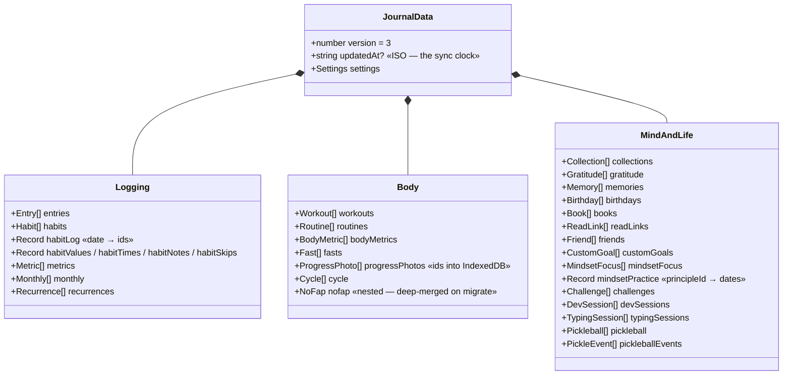
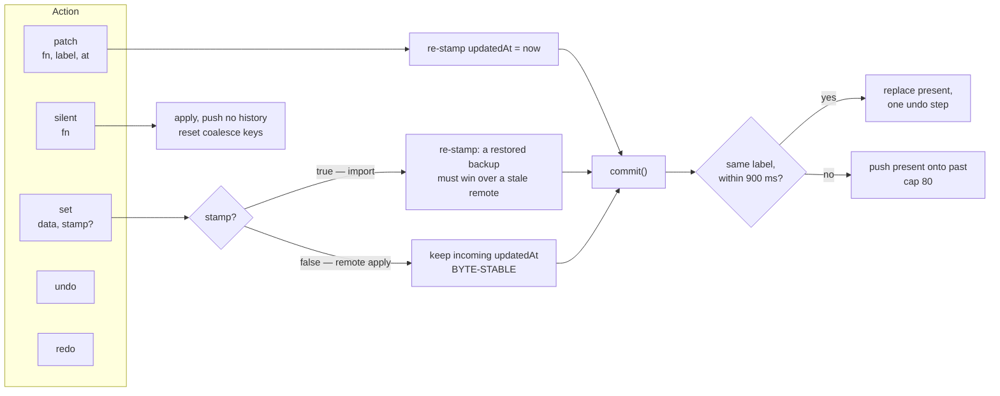
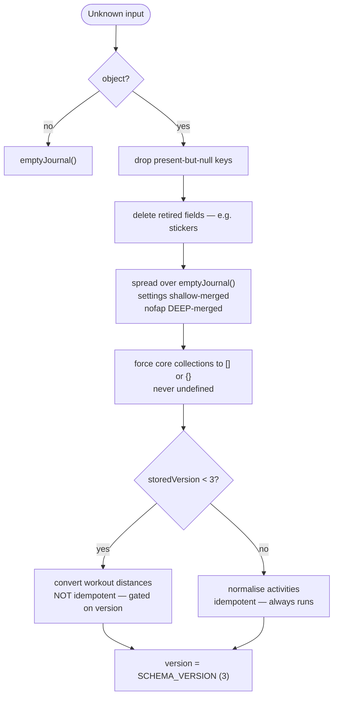
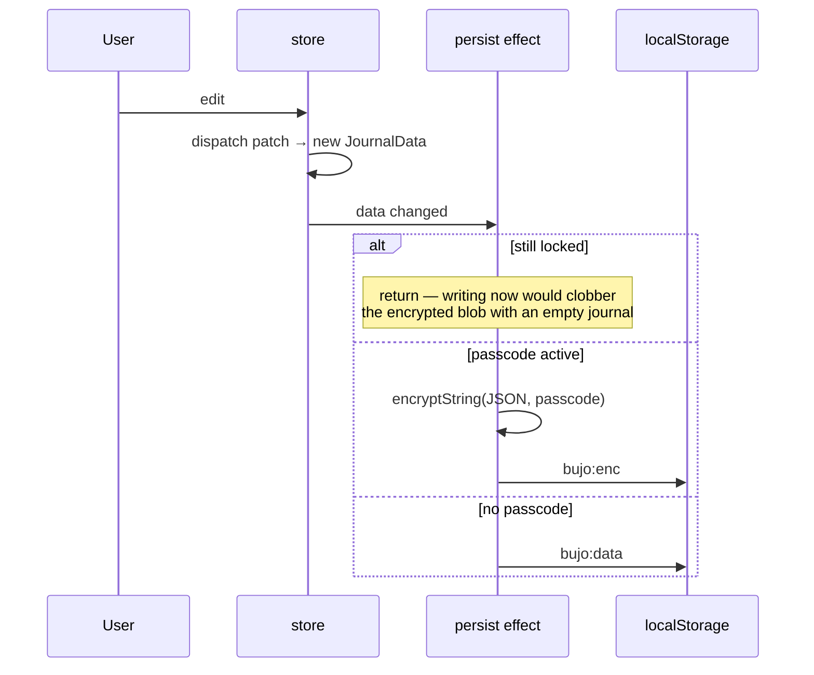

# Data model and state

One object, one reducer, five action types. The shape is easy; the interesting
part is what each action type *means*, because choosing the wrong one is how
sync loops and lost undo steps happen.

## JournalData

`SCHEMA_VERSION` is **3**. Everything the app knows lives under one root, and
almost every field is optional — a journal written by any older build is a valid
input to `migrate()`.

Two shape decisions worth knowing before you add a field:

**`mindsetPractice` is keyed by principle, not by focus row.** Clear a focus
slot and re-add the same principle later and the practice history is still
there. Keying it by the focus row's id would have quietly reset a streak every
time someone reorganised their slots.

**Photos are ids, not bytes.** `progressPhotos` holds references into the
IndexedDB store; the journal JSON stays small enough for `localStorage`. Every
export and remote push inlines them first — see
[storage and sync](storage-and-sync.md).

## The reducer

| Action | Stamps `updatedAt` | Enters undo history | Use for |
|---|---|---|---|
| `patch` | yes | yes | every user edit |
| `set` + `stamp` | yes | yes | importing a backup |
| `set` | **no — byte-stable** | yes | applying a remote copy |
| `silent` | no | **no** | mount-time normalisation |
| `undo` / `redo` | — | moves between past and future | ⌘Z, the undo toast |

### The three constants, and why each exists

**`COALESCE_MS = 900`.** Consecutive edits sharing a label inside 900ms collapse
into one undo step. Without it, typing a sentence into an entry costs one undo
step per keystroke and ⌘Z becomes useless. With it, ⌘Z undoes *the sentence*.

**`HISTORY_CAP = 80`.** Both `past` and `future` are capped. Each entry is a full
`JournalData` snapshot — structurally shared, but 80 of them is the bound on how
much a long editing session can hold.

**`'silent'` resets `lastLabel` and `lastAt`.** Not incidental. A remote apply
lands between two user edits that share a label; without the reset, the second
edit coalesces into an undo step taken *before* the remote arrived, and undoing
it reverts across the remote apply. One line, and it is the difference between
undo being trustworthy and undo being a bug report.

### Byte-stability is a contract with another file

`set` without `stamp` keeps the incoming `updatedAt` exactly as received, because
the Supabase echo guard compares `JSON.stringify` of the whole journal against
what it last pushed. Re-stamp on apply and the strings differ, the guard misses,
and the app enters a push-apply-push loop with a network round-trip in it.

That is a coupling across three files with nothing enforcing it. If you are
changing the reducer, this is the line to be careful with.

## migrate(): the tolerant reader

Every load, every import, and every remote copy goes through `migrate()`. It is
the only place that has to cope with a journal written by a build that no longer
exists.

Four behaviours here that are each load-bearing:

**Null-stripping comes before the merge.** A corrupt payload with `metrics: null`
would otherwise overwrite the default `[]`, and every `.map` over it throws. The
spread alone is not enough, because `null` is a present value.

**`nofap` is deep-merged; `settings` is shallow-merged.** `nofap` is nested state
whose consumers assume `best`, `relapses` and `startedOn` exist — a partial one
breaks `logRelapse`. The distinction is deliberate and undocumented anywhere
else.

**Idempotent normalisations run every load; non-idempotent ones are
version-gated.** Activity normalisation maps a key to itself, so running it on
every load makes it a tolerant reader for anything arriving from an old client
over cloud sync. The distance conversion multiplies by 1.61 — run it twice and
the number is wrong — so it hangs off `storedVersion < 3`. **This is the reason
`SCHEMA_VERSION` exists.** A conversion that is not idempotent needs a version
to gate on.

**Deleting a retired field is destructive, and was confirmed as such.** The
`stickers` delete means a journal saved after the upgrade no longer holds the
stickers a user placed, and they are unrecoverable from that file. Backups taken
before the upgrade still have them. The alternative — leaving the key — carries
an orphaned field through every round-trip forever.

## Persistence

The `if (!unlocked) return` is the whole lock safety. Without it, the first
render of a locked app writes an empty journal over the user's encrypted blob.

## Follow-up questions

1. A user types a 40-character note, waits two seconds, types ten more
   characters, then presses ⌘Z twice. What is on screen, and why does the answer
   depend on whether both edits shared a label?
2. A remote copy arrives while the user is mid-sentence in an entry. Trace which
   reducer action applies it, what happens to `lastLabel`, and what the user's
   next ⌘Z now undoes.
3. You need to add a field whose old values must be divided by 2. Which parts of
   `migrate()` do you touch, and what happens if you skip the version bump?
4. `set` without `stamp` keeps `updatedAt` byte-stable for the echo guard. Name
   a change to `mergeJournals` that would break the guard without touching the
   reducer at all.

## See also

- [Storage and sync](storage-and-sync.md) — where this object goes
- [Shell and views](shell-and-views.md) — who reads it
- `src/lib/types.ts` — the authoritative shape
