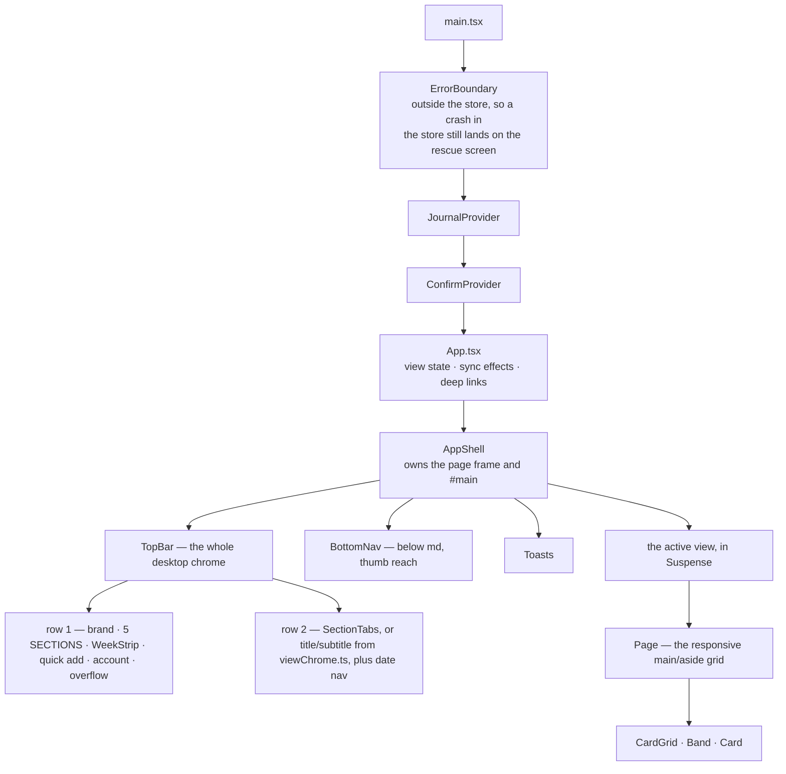
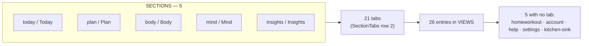
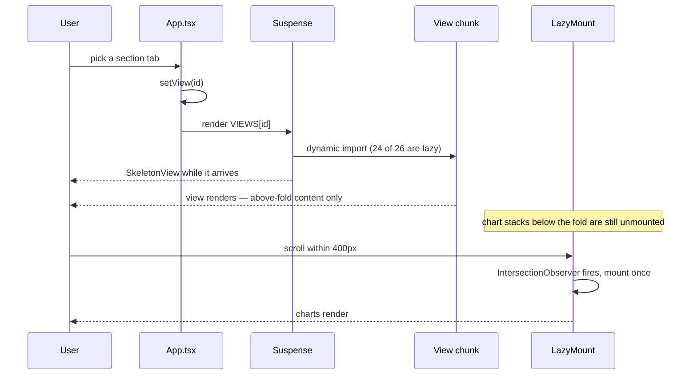
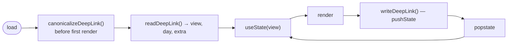

# Shell and views

How 26 views reach the screen through 5 sections, 24 lazy chunks and no router.

There is no routing library here. `App.tsx` holds a `view` in `useState`, looks
it up in a `Record<ViewId, ComponentType>`, and renders it. The URL is kept in
step by hand. That is a deliberate trade — the whole nav surface is two files you
can read — and it has consequences worth knowing before you add a view.

## The frame

**There is no sidebar.** Worth saying because a diagram in this repo drew one
for months: `Shell --> Sidebar` in the old `uml.mdx`, with no such component
anywhere in `src/` — the only match is an icon of that name. Navigation is the
top bar on desktop, the top bar plus `BottomNav` on phones.

## Sections, tabs and views are three different counts

| Count | What it is | Where |
|---|---|---|
| **5** | Sections — the top-level nav, repeated in `BottomNav` | `shell/sections.ts` |
| **21** | Tabs across those sections | the `tabs` arrays |
| **26** | Renderable views | `VIEWS` in `App.tsx` |

The five with no tab are reachable but not browsable: `settings`, `account` and
`help` hang off the overflow menu, `kitchen-sink` is a dev surface, and
`homeworkout` is reached from inside Fitness. **This asymmetry is the thing to
check when you add a view** — adding a `VIEWS` entry makes it renderable and
reachable by URL, and does nothing to make it findable.

`BottomNav` and `TopBar` both read `SECTIONS` directly. They used to be filtered
against a hand-written `PRIMARY` id list, so retiring a nav id silently dropped
its phone tab with no error and left the bar at three. There is no second list
any more — do not reintroduce one.

## Loading: 24 lazy chunks and a mount deferral

Two different mechanisms, often confused, solving two different problems.

| | `lazy()` + Suspense | `LazyMount` |
|---|---|---|
| Defers | fetching the **code** | rendering the **DOM** |
| Granularity | a whole view, 24 of 26 | a section within a view |
| Trigger | navigation | scroll within `rootMargin: 400px` |
| Reverses? | no | **no — mount-once, never unmounts** |

`LazyMount` renders a skeleton at a declared height until it mounts, so the
scrollbar and everything below hold still. A lazy section that changes height on
load is worse than an eager one. It is mount-once by design: the point is
skipping work a visit never needs, not windowing — unmounting on scroll-out
would throw away chart state to save something nobody measured.

**Both scanning gates dispatch `bujo:reveal-lazy` before measuring, and that is
load-bearing.** An unmounted element cannot be measured, so without it every
deferred chart stack is invisible to `a11y` and `clipped` — the closed-fold trap
in a new shape. A scroll-walk was tried instead and reverted: the hide-on-scroll
header intercepted the a11y script's own clicks.

## The URL

`canonicalizeDeepLink()` runs in `main.tsx` **before** `createRoot`, so every
reader — including lazy view chunks that mount long after the address bar was
rewritten — sees one canonical URL.

`writeDeepLink` uses `pushState`, not `replaceState`, which is what makes Back
and Forward mean something. It also makes the `popstate` listener load-bearing:
without it the buttons would move the URL and not the app. The two changed
together and have to stay together.

## Layout primitives

| Primitive | Owns | Trap |
|---|---|---|
| `Page` | the responsive `main` / `aside` grid every view opts into | `gap` is set at two breakpoints; overriding only the base leaves the `sm:` one live |
| `CardGrid` | the card grid | **spell the phone column out.** A grid with no `grid-template-columns` gets one implicit `auto` track sized to the widest item's min-content, and a track is shared — one wide card drags every sibling with it |
| `Band` / `BandRow` / `BandCell` | full-width horizontal bands, cells carrying their own basis | `BandRow` wraps by default; `wrap={false}` means cells get narrow rather than wrapping, which is sometimes right and always a decision |
| `Statement` | the one loud line per band, `max-w-[20ch]`, balanced | at 20ch almost everything wraps — a spaced dash is bound to the preceding word so it can never start a line |
| `useHeaderHeight` | measures and republishes `--header-h` | never hard-code it: the header wraps at narrow widths and grows by the notch on a phone |

## Adding a view — the checklist that is not written anywhere else

1. Add the component and a `ViewId`.
2. Register it in `VIEWS` in `App.tsx`. It is now renderable and URL-reachable.
3. Add a tab in `SECTIONS` — or decide deliberately that it is one of the five
   that has none, and say where it is reached from.
4. Give it chrome in `viewChrome.ts` if its section has one surface.
5. **Add it to the `VIEWS` list in `scripts/a11y-axe.mjs` and
   `scripts/clipped-text.mjs`.** Those lists are hand-written. A page that is not
   on them is not checked, and "0 serious" then means "0 serious for the pages
   somebody remembered".

Step 5 is the one that gets missed, and it fails silently in the most reassuring
possible way. Recovery was once excluded from the a11y list on the reasoning
that it sat behind an opt-in; `nofapEnabled` defaults to true, and adding the
page immediately failed on a contrast bug.

## Follow-up questions

1. A view is in `VIEWS` but in no `SECTIONS` tab and no gate list. Name every
   way a user can still reach it, and every gate that will report it clean.
2. `LazyMount` is mount-once. Construct a case where that costs memory, then
   argue whether windowing would actually be cheaper.
3. Why can't the a11y gate simply scroll the page instead of dispatching
   `bujo:reveal-lazy`? (The answer is in the header.)
4. `writeDeepLink` switched from `replaceState` to `pushState`. What broke, and
   what had to be added in the same change?

## See also

- [Verification pipeline](verification-pipeline.md) — the hand-written view lists, and why they rot
- [Data model and state](data-model.md) — what the views read
- `src/components/shell/README.md` — the change → file table for this directory
