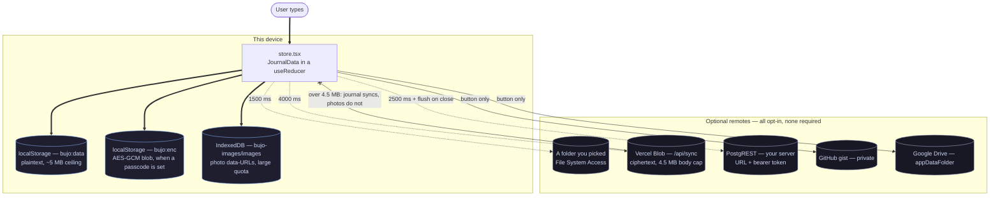
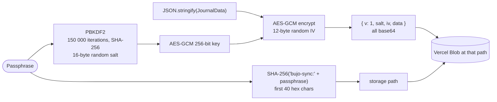
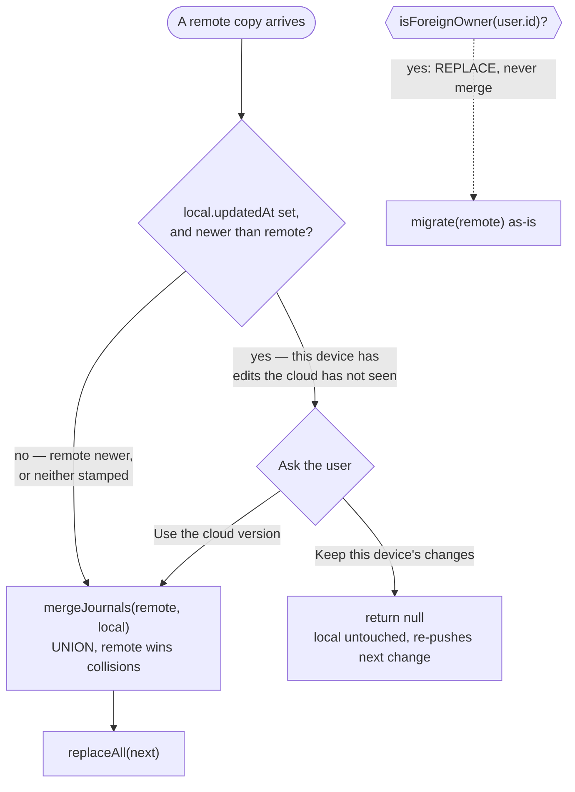
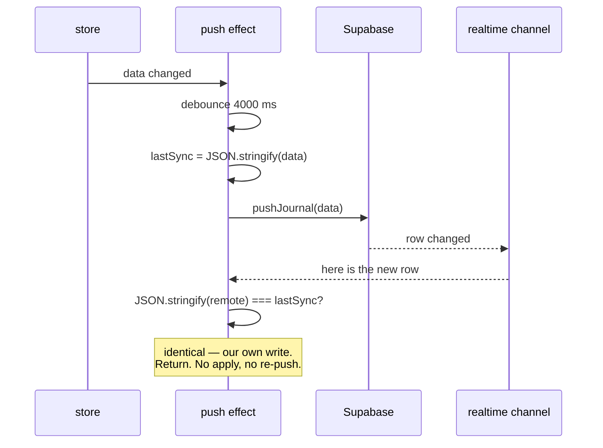

# Storage and sync

Where a keystroke ends up, and which of the seven write paths can lose it.

bujo is local-first: the source of truth is the `JournalData` object in memory,
and every remote is an *optional* mirror of it. That sentence is in
`ARCHITECTURE.md` too, and on its own it is misleading — it suggests one store
and some backups. There are two local stores with different quotas and different
failure modes, and five remotes with four different trigger models between them.

## The whole picture

`bujo:data` and `bujo:enc` are exclusive, not both: the persist effect writes one
or the other depending on whether a passcode is active.

## The write paths, and what each one costs

| Target | Trigger | Debounce | Carries photos | Module |
|---|---|---|---|---|
| `localStorage` | every state change | none | no — ids only | `lib/storage.ts` |
| IndexedDB | on image add | none | yes, the bytes | `lib/imageStore.ts` |
| Picked folder | every state change | **1500 ms** | yes | `lib/fscloud.ts` |
| Vercel Blob | every state change | **4000 ms** | **within 4.5 MB** | `lib/bujocloud.ts` |
| Self-host PostgREST | every state change | **2500 ms**, plus a keepalive flush on `pagehide` / `visibilitychange` | yes | `lib/serverSync.ts` |
| GitHub gist | a button | — | yes | `lib/github.ts` |
| Google Drive | a button | — | yes | `lib/gdrive.ts` |

Two things fall out of that table that are not obvious from any one file:

**Only the self-host path flushes on close.** The others rely on their timer
having fired. Close a tab 3 seconds after an edit with only Blob sync on, and
that edit is on the device but not in the cloud until the next change wakes the
debounce. It is not lost — `localStorage` has it — but "synced" is not the same
as "saved", and the gap is up to 4 seconds wide.

**Photos take a different road to every destination.** They live in IndexedDB
referenced by id, so the journal JSON stays small. Every export and every remote
push has to *inline* them first, and the Blob path is the one that cannot always
afford to: Vercel caps a request body at 4.5 MB, so `inlineImagesWithinBudget`
sends what fits and reports `photos-skipped` rather than failing the whole push.
A journal that syncs cleanly can still be missing its images on the other side.

## Encryption, and what the server can see

The passphrase derives **two independent things**: the key, which never leaves
the device, and the *path*, which does. The server stores ciphertext at a
location it cannot invert back to the passphrase. There are no accounts on this
path at all.

Worth stating plainly, because it is the part people get wrong when reasoning
about this design: **the passphrase is the only copy of the key.** There is no
recovery, by construction. Lose it and the blob is noise. The same is true of
the local `bujo:enc` passcode — `docs/PRODUCT_GAPS.md` lists recovery as an open
gap, and it is open on purpose rather than by omission.

Note also that `b64()` chunks its byte-to-char conversion at `0x8000`. That is
not a micro-optimisation: `String.fromCharCode(...bytes)` overflows the call
stack on an image-heavy journal, which is a crash at exactly the moment a user
has the most to lose.

## The conflict branch — the only place sync asks a question

Every other decision here is silent. This one is not, because it is the only one
that can destroy work that exists nowhere else.

Three things this diagram is drawn to make visible:

**Adopting the remote is still a union.** `mergeJournals(remote, local)` keeps
local-only items even when the user chose the cloud version. A raw `replaceAll`
here once dropped every item a device had never synced; the comment in `App.tsx`
records it. "Use the cloud version" means *the cloud wins collisions*, not *the
local disappears*.

**The default answer, when no prompt is wired, is keep-local.** `resolveIncoming`
defaults `ask` to `() => false`. That only applies where a caller passes nothing
(tests, no DOM). Keeping local stalls adoption until the next change; the other
default silently clobbers unsynced work, and a stall is recoverable where a
clobber is not.

**Historical — there are no accounts and no `bujo:owner` key in the source any
more.** It recorded which account the local journal belonged to, so that a
*different* account signing in replaced outright instead of folding one person's
journal into another's (COD-135). Kept here because the hazard it guarded is
real for any future multi-identity remote: merging is the right default exactly
until the two sides are different people.

## The echo guard

**Supabase's realtime channel is gone; the guard it forced is not, and still
matters.** Realtime delivered your own write straight back to you: applying it
re-rendered, which triggered the push effect, which wrote again — a loop with a
network round-trip in it. The remaining remotes pull rather than push, so they
reach the same place more slowly (a poll returns the row you just wrote), and
the same comparison stops it. The sequence below is the original Supabase case,
kept because it is the clearest drawing of the loop.

The guard is a **string comparison of the whole journal**, which is why the
`'set'` reducer action keeps an incoming `updatedAt` byte-stable instead of
re-stamping it. Re-stamping on apply would change the string, the guard would
miss, and the loop would close. That coupling — a reducer case existing to keep
a string comparison in another file working — is the kind of thing that gets
refactored away by someone who cannot see both ends at once.

## Failure modes

| What happens | What you see | Where it is handled |
|---|---|---|
| `localStorage` quota exceeded | `save()` returns false; quota meter warns near full | `lib/storage.ts` |
| Journal over 4.5 MB with photos | Syncs without images, state `photos-skipped` | `lib/bujocloud.ts` |
| Two devices edit offline | Conflict prompt on the second one to reconnect | `lib/conflict.ts` |
| Folder permission revoked | Silent no-op; sync stops until re-picked | `App.tsx`, `lib/fscloud.ts` |
| Passphrase lost | Ciphertext is unrecoverable. By design. | — |
| Another account's journal on this device | Replaced, never merged | `isForeignOwner`, COD-135 |
| Browser evicts the origin under storage pressure | Total local loss | `navigator.storage.persist()` in `main.tsx`, best-effort |

That last row is why `main.tsx` asks for persistent storage before the first
render. It is best-effort — unsupported or denied is fine — and weekly backups
remain the real safety net. A local-first app has nothing to re-fetch from.

## See also

- [Data model and state](data-model.md) — what is being written, and `migrate()`
- [Verification pipeline](verification-pipeline.md) — which gates cover this, and which cannot
- `docs/PRODUCT_GAPS.md` — the ranked list, including passcode recovery
- `docs/DATA-STORE-DECISION.md` — why localStorage rather than IndexedDB for the journal itself
