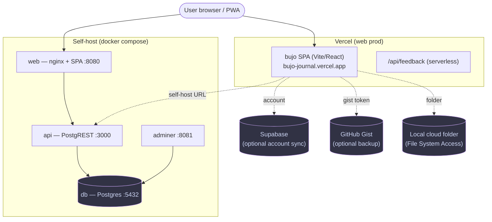
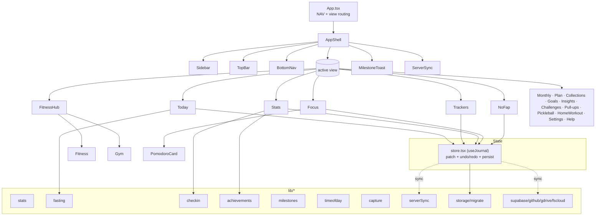
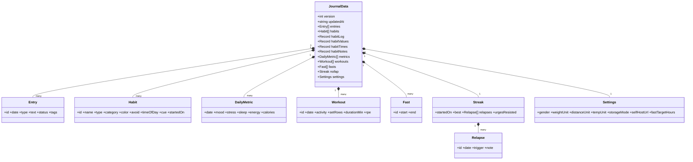
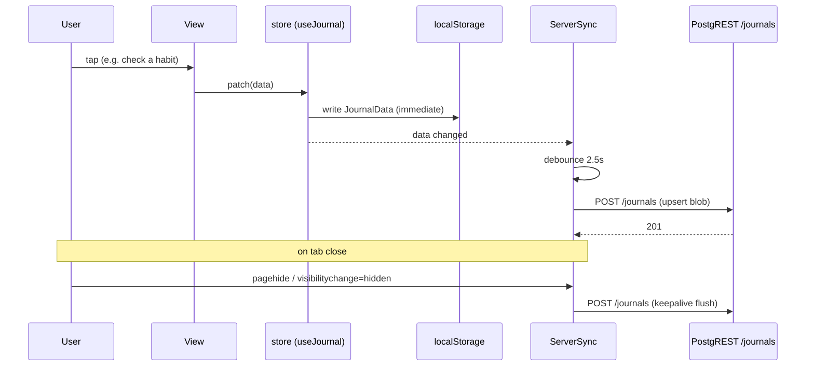
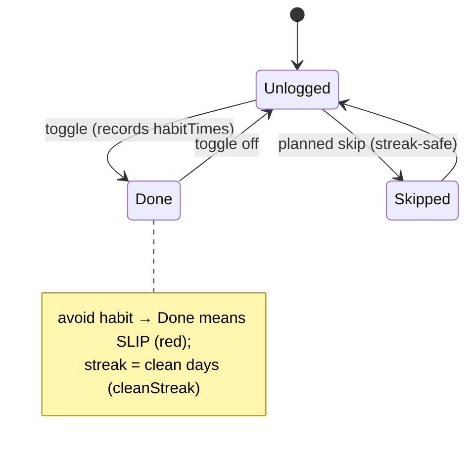

# System UML

All diagrams are [Mermaid](https://mermaid.js.org/) — they render on GitHub and in MDX. Keep them in sync with the code (see `docs/RULES.md`).

## 1. Deployment / system context

bujo is **local-first**: the source of truth is the in-browser `JournalData`. Every backend (Vercel, Supabase, self-host PostgREST, gist, folder) is an *optional* sync target. With E2E, those targets hold ciphertext.

## 2. Frontend component structure

## 3. Data model (class diagram)

## 4. Sync sequence (save → persist → flush on close)

## 5. Habit check-in state (one habit / day)

## Regenerating
These are hand-maintained from the code. When the data model, component tree, or sync paths change, update the relevant diagram in the **same PR** — `docs/RULES.md` makes this a checklist item, and `.github/workflows/docs-guard.yml` flags code-only PRs.
