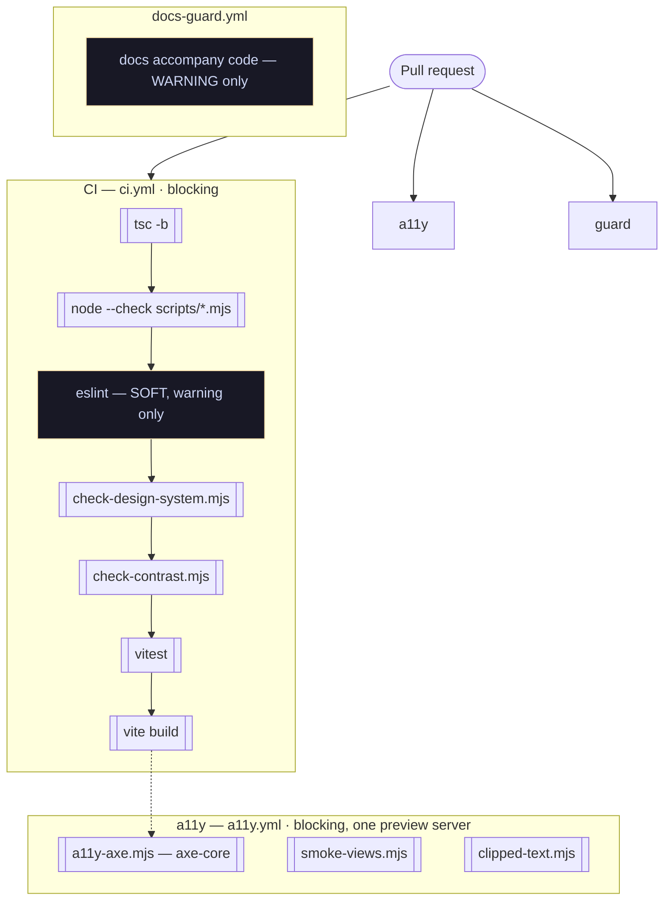

# Verification pipeline

Eleven checks across three workflows. The useful thing to know about each is not
what it catches — it is **what it structurally cannot**, because that is where
the bugs in this repo have actually lived.

## The shape



**Two of the eleven cannot fail the build.** `eslint` is run as
`npx eslint . || echo "::warning::…"` because the repo carries pre-existing debt,
and `docs-guard` only ever emits a warning. Knowing which checks are advisory is
part of reading a green tick honestly.

## What each one cannot catch

| Gate | Blind to |
|---|---|
| `tsc -b` | Anything not type-level. A data module nobody imports any more is not an error — `views/Pullups.tsx` once inlined its lists and `PULLUP_WORKOUTS` went from fourteen formats to three with every gate green. |
| `node --check scripts/*.mjs` | Everything except syntax. It exists because the `.mjs` scripts sit outside every other gate — `tsc` ignores them, eslint does not cover them, the build never imports them — and a syntax error once reached `main` and surfaced only when the screenshots workflow ran. |
| `eslint` | **Nothing it reports blocks anything.** A new error lands as a warning beside two pre-existing ones. |
| `check-design-system.mjs` | Only the rules it encodes: a solid accent button, a px icon size, a retired variant, a glyph name rendering as a label. Each was a real regression caught by eye first — one of them by the user, in a shipped view. |
| `check-contrast.mjs` | Only the palette files. It is *static*, which is its advantage: it grades every token rather than the tokens the demo journal happens to render. |
| `vitest` | **Layout.** jsdom has no layout engine, so every geometric defect in this repo's history was invisible here. It also does not typecheck — a `tsc` error and a green vitest run coexist happily. |
| `vite build` | **A stale Tailwind utility.** v4 exits 0 and emits no CSS for a class that no longer exists; the element silently inherits. When retiring a class, migrate every call site first and use a grep as the gate. |
| `a11y-axe.mjs` | A branch the seed never takes, and any page not on its hand-written `VIEWS` list. |
| `smoke-views.mjs` | Anything it does not recognise as a console error. It asserts its own identity now, which it did not always. |
| `clipped-text.mjs` | A clip an ancestor causes is covered; a scrollport crushed to nothing and a field overflowing downward were not, until they were added. |
| `docs-guard.yml` | **Which** doc. Any file under `docs/`, any `.test.`, `TICKETS.md` or `WORKLOG.md` satisfies it — so a PR can update an unrelated doc and pass, and two diagrams can diverge for months while every PR shows green. |

## Every gate here exists because something got through

This is the part worth reading before adding a check of your own. Each row is a
real failure, and the pattern across them is sharper than any individual entry.

| The gate | The failure that created it |
|---|---|
| smoke asserts `document.title` starts with `bujo` **and** `#main` exists | It defaulted to port 5173 — Vite's *dev* default, i.e. whichever project on the machine booted first — drove a different application entirely, and printed `Smoke: 25/25 views OK · All views rendered clean`. Three PRs quoted that line as evidence. Its pass condition was "more than five characters of text", which any web page satisfies. |
| a11y loads `?demo=1` and asserts the seed landed | It ran against an empty journal, so every `{rows.length > 0 && …}` was absent from the DOM and could not fail. Arming it turned one green run into **16 serious violations** that had been invisible for the gate's entire existence. |
| a11y opens every fold before scanning | axe walks the rendered page, so anything behind a closed section was simply not checked — folding a section was a way to make a violation disappear, and one contract pass did exactly that to a **1.41:1** contrast bug in the same commit. |
| `check-contrast.mjs` exists at all | The palette was written down twice — `src/index.css` and `src/lib/colors.ts` — and had diverged. `text-red` painted `#f14c4c` while `cat('red')` painted `#f57979` **on the same screen**. |
| contrast is static, not rendered | latte's `yellow` sat at **2.02:1** with the armed a11y gate green, because its only render is one branch of a ternary the demo seed never takes. |
| clipped runs at 390 as well as 1440 | It only ever ran at the width where text is *least* likely to clip. |
| clipped checks ancestor reachability | A button at x=453 in a 390px viewport passes both other gates: it shows everything it holds, and it is focusable and named. The clip happens at an ancestor, and `document.body.scrollWidth` still reads 390. Trackers shipped a seven-control toolbar unreachable on a phone. |
| clipped checks field overflow and crushed scrollports | A cue field showed 54px of a 147px note, and a filter row was squeezed to **10px** while its contents were "reachable" because an ancestor scrolled. |
| `lib/notify.test.ts` | 26 native `alert()` calls survived for months. Nothing in the toolchain objects to `alert()`. |
| `lib/pullups.test.ts` asserts counts | A pass rewrote a view's lists inline instead of importing the data module. An export nobody imports is not an error, and the page still rendered a plausible list. |
| vitest excludes `.claude/worktrees` | Each worktree holds a second copy of the app, so vitest discovered both suites and reported their sum — **743 tests read as 1474**. The number moved with what else was checked out, and was quoted in commit messages. |

## The two patterns

Read down that table and the same two shapes keep appearing.

**Something that never renders cannot fail.** An empty journal, a closed fold, a
ternary branch the seed never takes, a page missing from a hand-written list, a
deferred chart stack. Every one of them produces the same reassuring zero as
genuine coverage. The defence is to **assert the precondition**: smoke asserts
its identity, a11y asserts the seed landed and opens the folds, both scanners
dispatch `bujo:reveal-lazy`. A browser gate that does not check what it is
pointed at is not measuring anything.

**A gate nobody runs is a gate that rots.** Smoke was local-only, which is how it
sat on a wrong port for so long. `clipped` was worse — it was in `package.json`
and in *no workflow at all*, so the only thing keeping it honest was somebody
remembering to type it; both Mindset defects above were sitting in front of it.
Both now run in CI. When a gate needs a manual incantation, fix the gate: a
workaround written down in `STATUS.md` is a gate that is switched off.

A corollary, from the smoke story specifically: **"environmental, not a
regression" in a handover note means a gate has been switched off.** A gate known
to fail has a red that carries no information, so it stops covering anything —
and two Body tabs fell off smoke's id list unnoticed while that sentence was in
the file.

## Running them locally

```bash
npm run verify        # tsc -b && vitest run && eslint . && vite build

npm run build && npm run preview &     # the browser gates need a server
BUJO_URL=http://localhost:4173 npm run a11y
BUJO_URL=http://localhost:4173 npm run smoke
BUJO_URL=http://localhost:4173 npm run clipped

npm run design        # static
npm run contrast      # static
```

Capture exit codes **directly**, not through a pipe. `npx tsc -b | tail; echo $?`
reports `tail`'s status and prints a cheerful `0` over a real failure — which has
already happened at least once in this repo's history.

Two traps when reading browser-gate output:

- **`vite preview` serves a stale bundle through its service worker.** Unregister
  it, clear `caches`, reload — before believing any screenshot.
- **A dev server is pinned to the worktree it was started in.** Several live
  under `.claude/worktrees/`; a tab on one of their ports will never show your
  changes. Check the port's owning process before concluding a change did not
  land.

## Follow-up questions

1. A PR adds a view, a card that only renders when a habit has a 30-day streak,
   and a new colour token. Which of the eleven checks can fail, which will pass
   regardless, and what would you add?
2. `eslint` is soft. Name a class of bug that would reach `main` today and say
   whether making it blocking is worth the debt cleanup it forces first.
3. `docs-guard` passes if any doc changed. Design a version that would have
   caught two UML files diverging — and say what it would cost in false alarms.
4. Both scanners depend on `bujo:reveal-lazy`. What happens to coverage if
   someone removes the dispatch, and which gate tells you?

## See also

- [Shell and views](shell-and-views.md) — the hand-written view lists
- [Storage and sync](storage-and-sync.md) — the paths none of these gates exercise
- `CLAUDE.md` — the traps, at source
- `docs/RULES.md` — which doc to update for which change
