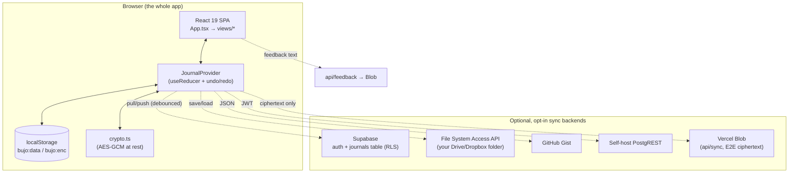
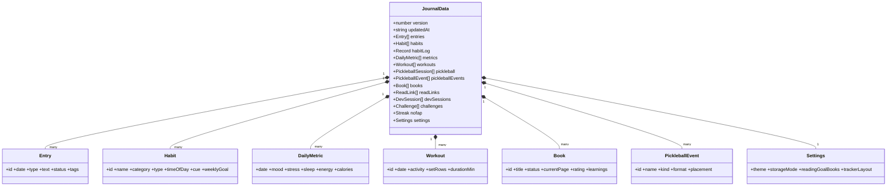
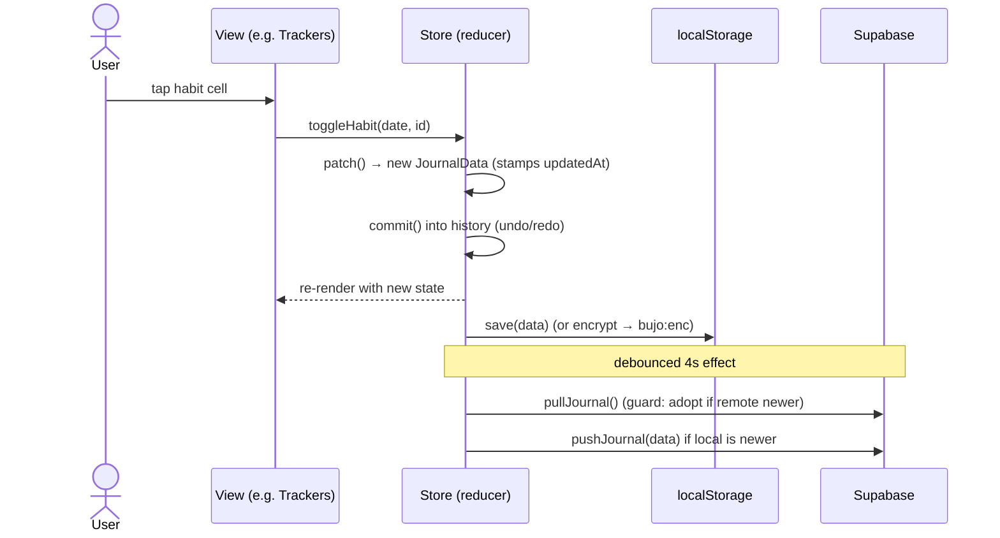
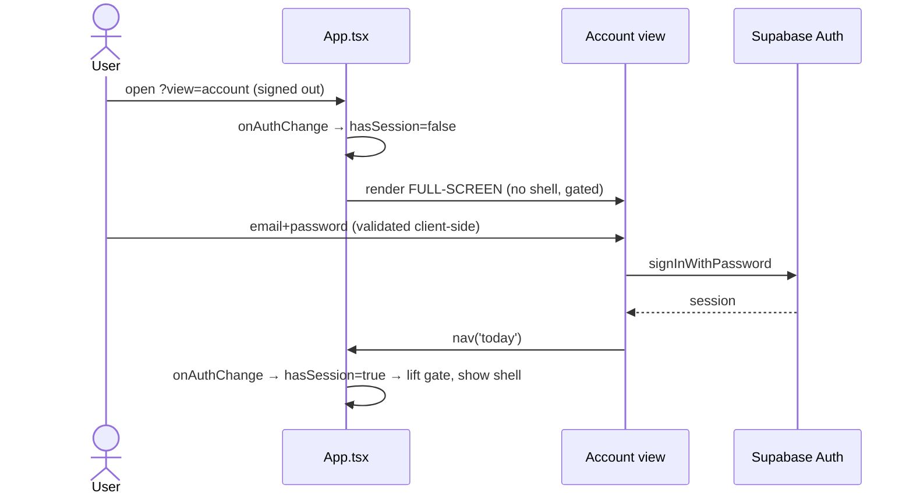
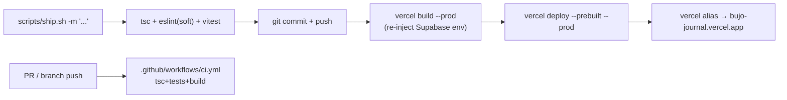

# UML — bujo

Mermaid diagrams. GitHub renders these inline.

## 1. Component / container diagram

How the pieces fit. The browser holds everything; the server is optional.

## 2. Class / data-model diagram

The single persisted root object and its main collections (`src/lib/types.ts`).

## 3. State-mutation sequence (a user edit)

Every write goes through the reducer; persistence + sync are effects.

## 4. Auth + gate sequence

## 5. Deploy pipeline

