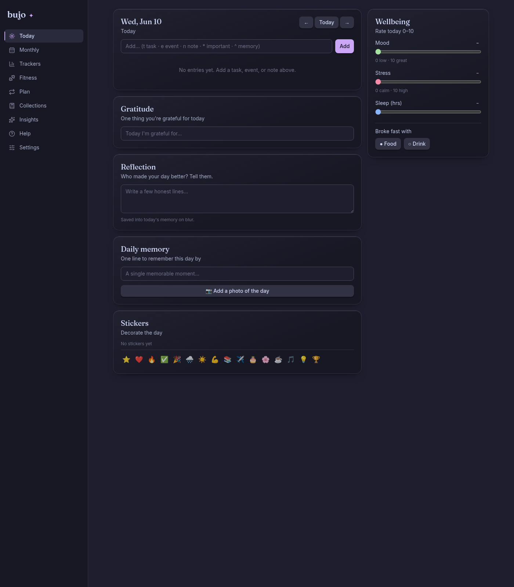
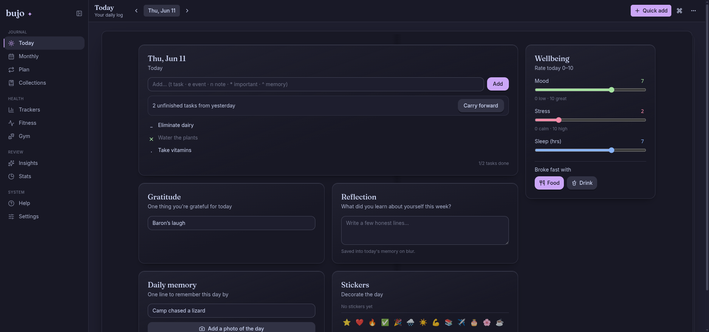
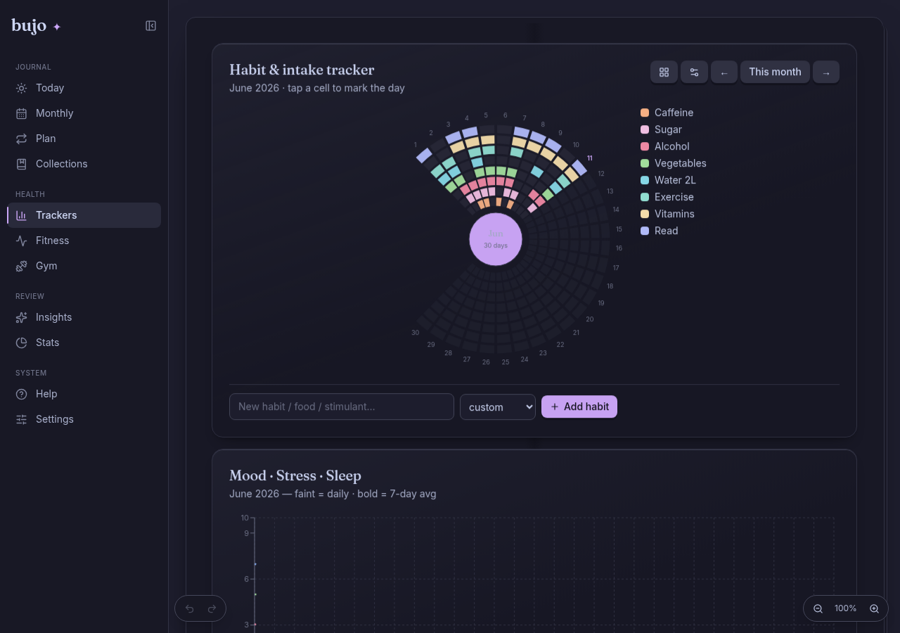
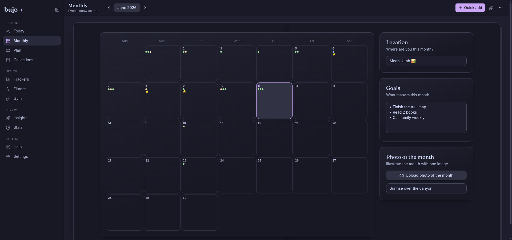
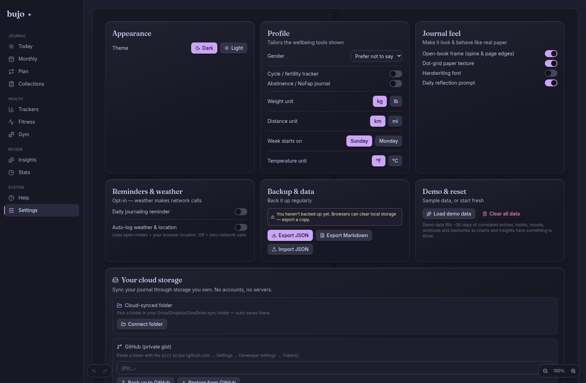
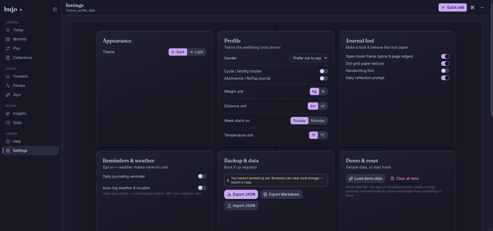

# Before / after

Screenshots from the live app (chrome-devtools MCP, 1440×900, demo data).

## Today

The dead right-side void is gone; the daily log sits above the fold and the
four secondary cards form a balanced grid instead of one tall column.

| Before | After |
|---|---|
|  |  |

## Monthly

The Location/Goals/Photo rail now wraps cleanly beside a full-width calendar,
and the month-nav lives in the top bar.

| Before | After |
|---|---|
|  |  |

## Settings

Equal-height cards; one consistent control vocabulary (Switch for on/off,
Segmented for enums).

| Before | After |
|---|---|
|  |  |

## Bundle budget

| Build | Initial JS (gzip) | Budget |
|---|---|---|
| Before redesign | 84.8 KB | < 200 KB |
| After (shell + shadcn) | ~113 KB | < 200 KB ✅ |

Chart views (Recharts) remain `React.lazy`, so the heaviest chunk
(`CartesianChart`, ~99 KB gzip) stays off the initial route. All 64 unit tests
stayed green throughout — the redesign touched presentation only.
